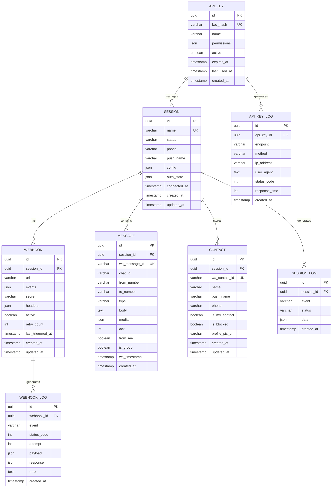
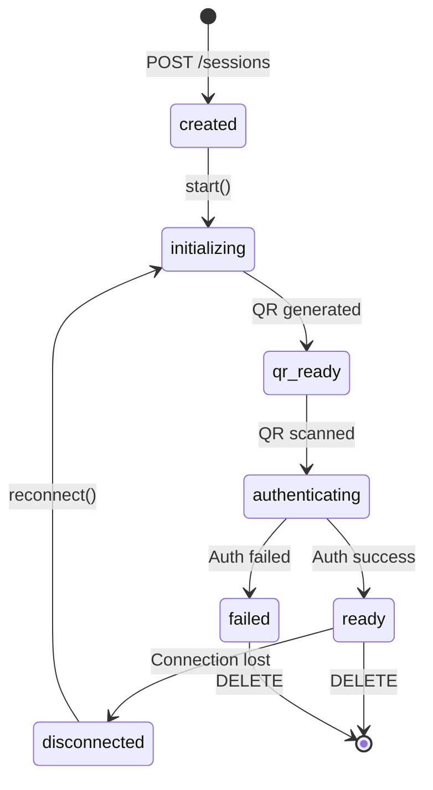
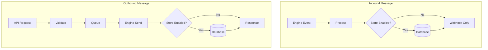
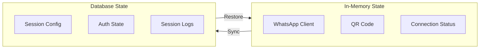
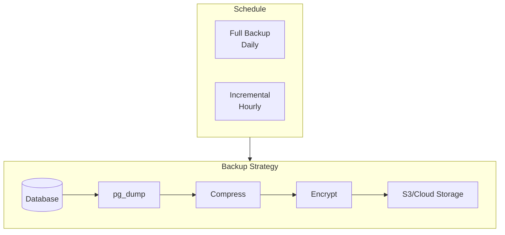

# 05 - Database Design

## 5.1 Overview

OpenWA uses a database to store:

- Session configuration & state
- Webhook configurations
- Message history (optional)
- API keys & authentication
- Audit logs

### Database Support

OpenWA supports two database backends that can be selected at deployment time:

| Database       | Use Case                                    | Sessions | Horizontal Scaling |
| -------------- | ------------------------------------------- | -------- | ------------------ |
| **SQLite**     | Development, personal bot, low-resource VPS | 1-5      | ❌                 |
| **PostgreSQL** | Production, multi-session, high volume      | 5+       | ✅                 |

> [!NOTE]
> **SQLite as a Production Option**
>
> SQLite can be used in production with limitations:
>
> - Maximum ~5 concurrent sessions (due to single-writer limitation)
> - No table partitioning support (requires auto-cleanup for messages)
> - No horizontal scaling support
> - Ideal for: personal bots, small businesses with 1-3 WhatsApp numbers
>
> For configuration, see [03 - System Architecture: Pluggable Adapters](./03-system-architecture.md#312-pluggable-adapters)

### Dual-Database Architecture

OpenWA v0.2+ implements a **dual-database architecture** that separates boot configuration from user data:

```
┌─────────────────────────────────────────────────────────────────┐
│                        OpenWA Application                        │
├─────────────────────────────┬───────────────────────────────────┤
│      Main DB (SQLite)       │        Data DB (Pluggable)        │
│     Always ./data/main.db   │   SQLite or PostgreSQL (config)   │
├─────────────────────────────┼───────────────────────────────────┤
│ • api_keys                  │ • sessions                        │
│ • audit_logs                │ • webhooks                        │
│                             │ • messages                        │
│                             │ • message_batches                 │
│                             │ • contacts                        │
└─────────────────────────────┴───────────────────────────────────┘
```

| Component   | Database             | Location             | Purpose                                    |
| ----------- | -------------------- | -------------------- | ------------------------------------------ |
| **Main DB** | SQLite (always)      | `./data/main.sqlite` | Boot-critical config, API keys, audit logs |
| **Data DB** | SQLite or PostgreSQL | Configurable         | User data, sessions, messages, webhooks    |

> [!IMPORTANT]
> **Why Dual-Database?**
>
> The Main DB is always SQLite to ensure the application can bootstrap without external dependencies:
>
> - API keys needed for authentication before any external DB connection
> - Audit logs must persist even if Data DB fails
> - Enables switching Data DB type without losing authentication

#### Pre-Bootstrap PostgreSQL Orchestration

When using PostgreSQL Built-in mode, OpenWA automatically:

1. Starts PostgreSQL container **before** NestJS bootstrap
2. Waits for health check (max 60 seconds)
3. Proceeds with application initialization

```typescript
// main.ts - Pre-bootstrap flow
if (process.env.POSTGRES_BUILTIN === 'true') {
  await preBootstrapPostgres(); // Start & wait for healthy
}
const app = await NestFactory.create(AppModule); // Then bootstrap
```

#### Data Migration API

OpenWA provides endpoints for migrating data between database types:

| Endpoint                 | Method | Description                          |
| ------------------------ | ------ | ------------------------------------ |
| `/api/infra/export-data` | GET    | Export all Data DB tables as JSON    |
| `/api/infra/import-data` | POST   | Import JSON data (replaces existing) |

**Migration Workflow:**

```bash
# 1. Export from current database
curl -s 'http://localhost:2785/api/infra/export-data' \
  -H 'X-API-Key: YOUR_KEY' > backup.json

# 2. Change database configuration (SQLite → PostgreSQL or vice versa)

# 3. Restart application with new config

# 4. Import to new database
curl -X POST 'http://localhost:2785/api/infra/import-data' \
  -H 'X-API-Key: YOUR_KEY' \
  -H 'Content-Type: application/json' \
  -d @backup.json
```

#### Cross-Database Date Portability

To ensure date/time values work across both SQLite and PostgreSQL, OpenWA uses a `DateTransformer` that stores dates as ISO 8601 text strings:

```typescript
// src/common/transformers/date.transformer.ts
export const DateTransformer: ValueTransformer = {
  from: (value: string | null) => value ? new Date(value) : null,
  to: (value: Date | null) => value ? value.toISOString() : null,
};

// Usage in entities (Data DB only)
@Column({ type: 'text', nullable: true, transformer: DateTransformer })
connectedAt: Date | null;
```

> [!NOTE]
> Main DB entities (api_keys, audit_logs) use native SQLite `datetime` type since they always remain in SQLite.

## 5.2 Entity Relationship Diagram



## 5.3 Table Specifications

### 5.3.1 sessions

Stores WhatsApp session configuration and state.

```sql
CREATE TABLE sessions (
    id UUID PRIMARY KEY DEFAULT gen_random_uuid(),
    name VARCHAR(100) NOT NULL UNIQUE,
    status VARCHAR(50) NOT NULL DEFAULT 'created',
    phone VARCHAR(20),
    push_name VARCHAR(100),
    config JSONB NOT NULL DEFAULT '{}',
    auth_state JSONB,
    connected_at TIMESTAMP WITH TIME ZONE,
    created_at TIMESTAMP WITH TIME ZONE NOT NULL DEFAULT NOW(),
    updated_at TIMESTAMP WITH TIME ZONE NOT NULL DEFAULT NOW()
);

-- Indexes
CREATE INDEX idx_sessions_status ON sessions(status);
CREATE INDEX idx_sessions_phone ON sessions(phone);
CREATE INDEX idx_sessions_created_at ON sessions(created_at);
```

> [!NOTE]
> `auth_state` is optional and engine-specific. By default, `whatsapp-web.js` stores auth state on the filesystem, while Baileys can store an encrypted blob in the database when enabled. This column can store the blob or an encrypted pointer/path.

**Session Status Values:**



| Status           | Description                  |
| ---------------- | ---------------------------- |
| `created`        | Session created, not started |
| `initializing`   | Starting browser & WhatsApp  |
| `qr_ready`       | QR code ready for scanning   |
| `authenticating` | QR scanned, authenticating   |
| `ready`          | Connected and ready          |
| `disconnected`   | Disconnected, can reconnect  |
| `failed`         | Failed, needs recreation     |

**Config Schema:**

```json
{
  "autoReconnect": true,
  "maxReconnectAttempts": 5,
  "puppeteer": {
    "headless": true,
    "args": ["--no-sandbox"]
  },
  "proxy": {
    "host": "proxy.example.com",
    "port": 8080,
    "username": "user",
    "password": "pass"
  }
}
```

---

### 5.3.2 webhooks

Stores webhook endpoint configurations.

```sql
CREATE TABLE webhooks (
    id UUID PRIMARY KEY DEFAULT gen_random_uuid(),
    session_id UUID NOT NULL REFERENCES sessions(id) ON DELETE CASCADE,
    url VARCHAR(2048) NOT NULL,
    events JSONB NOT NULL DEFAULT '["message.received"]',
    secret VARCHAR(255),
    headers JSONB DEFAULT '{}',
    active BOOLEAN NOT NULL DEFAULT true,
    retry_count INTEGER NOT NULL DEFAULT 3,
    last_triggered_at TIMESTAMP WITH TIME ZONE,
    created_at TIMESTAMP WITH TIME ZONE NOT NULL DEFAULT NOW(),
    updated_at TIMESTAMP WITH TIME ZONE NOT NULL DEFAULT NOW()
);

-- Indexes
CREATE INDEX idx_webhooks_session_id ON webhooks(session_id);
CREATE INDEX idx_webhooks_active ON webhooks(active);
```

**Events Schema (allowed values):**

```json
[
  "message.received",
  "message.sent",
  "message.ack",
  "message.revoked",
  "message.reaction",
  "session.status",
  "session.qr",
  "session.authenticated",
  "session.disconnected",
  "group.join",
  "group.leave",
  "group.update"
]
```

---

### 5.3.3 messages

Stores message history (optional, can be disabled).

```sql
-- Main table with partitioning support (PostgreSQL 12+)
CREATE TABLE messages (
    id UUID NOT NULL DEFAULT gen_random_uuid(),
    session_id UUID NOT NULL,
    wa_message_id VARCHAR(100) NOT NULL,
    chat_id VARCHAR(100) NOT NULL,
    from_number VARCHAR(50) NOT NULL,
    to_number VARCHAR(50),
    type VARCHAR(50) NOT NULL,
    body TEXT,
    media JSONB,
    ack INTEGER DEFAULT 0,
    from_me BOOLEAN NOT NULL DEFAULT false,
    is_group BOOLEAN NOT NULL DEFAULT false,
    wa_timestamp TIMESTAMP WITH TIME ZONE NOT NULL,
    created_at TIMESTAMP WITH TIME ZONE NOT NULL DEFAULT NOW(),

    PRIMARY KEY (id, created_at),
    UNIQUE(session_id, wa_message_id, created_at)
) PARTITION BY RANGE (created_at);

> [!NOTE]
> In PostgreSQL, UNIQUE on a partitioned table must include the partition key (`created_at`), so uniqueness applies per partition. If you need global uniqueness for `wa_message_id`, use a separate reference table or store messages in a non-partitioned table.

-- Create partitions for each month (automated via pg_cron or application)
CREATE TABLE messages_y2025m01 PARTITION OF messages
    FOR VALUES FROM ('2025-01-01') TO ('2025-02-01');
CREATE TABLE messages_y2025m02 PARTITION OF messages
    FOR VALUES FROM ('2025-02-01') TO ('2025-03-01');
CREATE TABLE messages_y2025m03 PARTITION OF messages
    FOR VALUES FROM ('2025-03-01') TO ('2025-04-01');
-- Continue for other months...

-- Default partition for future data
CREATE TABLE messages_default PARTITION OF messages DEFAULT;

-- Indexes (created on each partition automatically)
CREATE INDEX idx_messages_session_id ON messages(session_id);
CREATE INDEX idx_messages_chat_id ON messages(chat_id);
CREATE INDEX idx_messages_wa_timestamp ON messages(wa_timestamp);
CREATE INDEX idx_messages_session_chat ON messages(session_id, chat_id);
CREATE INDEX idx_messages_type ON messages(type);
CREATE INDEX idx_messages_from_me ON messages(from_me) WHERE from_me = true;

-- Function to auto-create partitions
CREATE OR REPLACE FUNCTION create_messages_partition()
RETURNS void AS $$
DECLARE
    partition_date DATE;
    partition_name TEXT;
    start_date DATE;
    end_date DATE;
BEGIN
    -- Create partition for next month
    partition_date := DATE_TRUNC('month', NOW() + INTERVAL '1 month');
    partition_name := 'messages_y' || TO_CHAR(partition_date, 'YYYY') || 'm' || TO_CHAR(partition_date, 'MM');
    start_date := partition_date;
    end_date := partition_date + INTERVAL '1 month';

    -- Check if partition exists
    IF NOT EXISTS (
        SELECT 1 FROM pg_tables WHERE tablename = partition_name
    ) THEN
        EXECUTE format(
            'CREATE TABLE %I PARTITION OF messages FOR VALUES FROM (%L) TO (%L)',
            partition_name, start_date, end_date
        );
        RAISE NOTICE 'Created partition: %', partition_name;
    END IF;
END;
$$ LANGUAGE plpgsql;

-- Schedule with pg_cron (run on 25th of each month)
-- SELECT cron.schedule('create-messages-partition', '0 0 25 * *', 'SELECT create_messages_partition()');
```

**Non-Partitioned Version (for SQLite or simpler installations):**

```sql
CREATE TABLE messages (
    id UUID PRIMARY KEY DEFAULT gen_random_uuid(),
    session_id UUID NOT NULL REFERENCES sessions(id) ON DELETE CASCADE,
    wa_message_id VARCHAR(100) NOT NULL,
    chat_id VARCHAR(100) NOT NULL,
    from_number VARCHAR(50) NOT NULL,
    to_number VARCHAR(50),
    type VARCHAR(50) NOT NULL,
    body TEXT,
    media JSONB,
    ack INTEGER DEFAULT 0,
    from_me BOOLEAN NOT NULL DEFAULT false,
    is_group BOOLEAN NOT NULL DEFAULT false,
    wa_timestamp TIMESTAMP WITH TIME ZONE NOT NULL,
    created_at TIMESTAMP WITH TIME ZONE NOT NULL DEFAULT NOW(),

    UNIQUE(session_id, wa_message_id)
);

CREATE INDEX idx_messages_session_id ON messages(session_id);
CREATE INDEX idx_messages_chat_id ON messages(chat_id);
CREATE INDEX idx_messages_wa_timestamp ON messages(wa_timestamp);
CREATE INDEX idx_messages_created_at ON messages(created_at);
```

**Media Schema:**

```json
{
  "mimetype": "image/jpeg",
  "filename": "image.jpg",
  "filesize": 102400,
  "url": "https://storage.example.com/...",
  "caption": "Check this out!"
}
```

---

### 5.3.4 contacts

WhatsApp contacts cache.

```sql
CREATE TABLE contacts (
    id UUID PRIMARY KEY DEFAULT gen_random_uuid(),
    session_id UUID NOT NULL REFERENCES sessions(id) ON DELETE CASCADE,
    wa_contact_id VARCHAR(100) NOT NULL,
    name VARCHAR(255),
    push_name VARCHAR(255),
    phone VARCHAR(20),
    is_my_contact BOOLEAN NOT NULL DEFAULT false,
    is_blocked BOOLEAN NOT NULL DEFAULT false,
    profile_pic_url TEXT,
    created_at TIMESTAMP WITH TIME ZONE NOT NULL DEFAULT NOW(),
    updated_at TIMESTAMP WITH TIME ZONE NOT NULL DEFAULT NOW(),

    UNIQUE(session_id, wa_contact_id)
);

-- Indexes
CREATE INDEX idx_contacts_session_id ON contacts(session_id);
CREATE INDEX idx_contacts_phone ON contacts(phone);
```

---

### 5.3.5 api_keys

Stores API keys for authentication.

```sql
CREATE TABLE api_keys (
    id UUID PRIMARY KEY DEFAULT gen_random_uuid(),
    key_hash VARCHAR(64) NOT NULL UNIQUE,
    name VARCHAR(100) NOT NULL,
    permissions JSONB NOT NULL DEFAULT '["*"]',
    active BOOLEAN NOT NULL DEFAULT true,
    expires_at TIMESTAMP WITH TIME ZONE,
    last_used_at TIMESTAMP WITH TIME ZONE,
    created_at TIMESTAMP WITH TIME ZONE NOT NULL DEFAULT NOW()
);

-- Indexes
CREATE INDEX idx_api_keys_key_hash ON api_keys(key_hash);
CREATE INDEX idx_api_keys_active ON api_keys(active);
```

**Permissions Schema:**

```json
["sessions:read", "sessions:write", "messages:send", "webhooks:manage"]
```

| Permission        | Description            |
| ----------------- | ---------------------- |
| `*`               | Full access            |
| `sessions:read`   | Read session info      |
| `sessions:write`  | Create/delete sessions |
| `messages:send`   | Send messages          |
| `messages:read`   | Read message history   |
| `webhooks:manage` | Manage webhooks        |
| `contacts:read`   | Read contacts          |
| `groups:read`     | Read groups            |
| `groups:write`    | Manage groups          |

---

### 5.3.6 session_logs

Audit log for session events.

```sql
CREATE TABLE session_logs (
    id UUID PRIMARY KEY DEFAULT gen_random_uuid(),
    session_id UUID NOT NULL REFERENCES sessions(id) ON DELETE CASCADE,
    event VARCHAR(100) NOT NULL,
    status VARCHAR(50),
    data JSONB,
    created_at TIMESTAMP WITH TIME ZONE NOT NULL DEFAULT NOW()
);

-- Indexes
CREATE INDEX idx_session_logs_session_id ON session_logs(session_id);
CREATE INDEX idx_session_logs_event ON session_logs(event);
CREATE INDEX idx_session_logs_created_at ON session_logs(created_at);

-- Auto-cleanup old logs (PostgreSQL)
-- Consider pg_cron or application-level cleanup
```

---

### 5.3.7 webhook_logs

Log delivery webhook.

```sql
CREATE TABLE webhook_logs (
    id UUID PRIMARY KEY DEFAULT gen_random_uuid(),
    webhook_id UUID NOT NULL REFERENCES webhooks(id) ON DELETE CASCADE,
    event VARCHAR(100) NOT NULL,
    status_code INTEGER,
    attempt INTEGER NOT NULL DEFAULT 1,
    payload JSONB NOT NULL,
    response JSONB,
    error TEXT,
    created_at TIMESTAMP WITH TIME ZONE NOT NULL DEFAULT NOW()
);

-- Indexes
CREATE INDEX idx_webhook_logs_webhook_id ON webhook_logs(webhook_id);
CREATE INDEX idx_webhook_logs_created_at ON webhook_logs(created_at);
CREATE INDEX idx_webhook_logs_status_code ON webhook_logs(status_code);
```

---

### 5.3.8 api_key_logs

Audit log for API access.

```sql
CREATE TABLE api_key_logs (
    id UUID PRIMARY KEY DEFAULT gen_random_uuid(),
    api_key_id UUID REFERENCES api_keys(id) ON DELETE SET NULL,
    endpoint VARCHAR(255) NOT NULL,
    method VARCHAR(10) NOT NULL,
    ip_address VARCHAR(45),
    user_agent TEXT,
    status_code INTEGER NOT NULL,
    response_time INTEGER,
    created_at TIMESTAMP WITH TIME ZONE NOT NULL DEFAULT NOW()
);

-- Indexes
CREATE INDEX idx_api_key_logs_api_key_id ON api_key_logs(api_key_id);
CREATE INDEX idx_api_key_logs_created_at ON api_key_logs(created_at);
CREATE INDEX idx_api_key_logs_endpoint ON api_key_logs(endpoint);
```

### 5.3.9 batch_jobs

Stores status for batch/bulk message jobs.

```sql
CREATE TABLE batch_jobs (
    id UUID PRIMARY KEY DEFAULT gen_random_uuid(),
    batch_id VARCHAR(100) NOT NULL UNIQUE,
    session_id UUID NOT NULL REFERENCES sessions(id) ON DELETE CASCADE,
    status VARCHAR(50) NOT NULL DEFAULT 'pending',
    total_messages INTEGER NOT NULL,
    sent_count INTEGER NOT NULL DEFAULT 0,
    failed_count INTEGER NOT NULL DEFAULT 0,
    cancelled_count INTEGER NOT NULL DEFAULT 0,
    options JSONB NOT NULL DEFAULT '{}',
    error TEXT,
    started_at TIMESTAMP WITH TIME ZONE,
    completed_at TIMESTAMP WITH TIME ZONE,
    created_at TIMESTAMP WITH TIME ZONE NOT NULL DEFAULT NOW(),
    updated_at TIMESTAMP WITH TIME ZONE NOT NULL DEFAULT NOW()
);

-- Indexes
CREATE INDEX idx_batch_jobs_session_id ON batch_jobs(session_id);
CREATE INDEX idx_batch_jobs_status ON batch_jobs(status);
CREATE INDEX idx_batch_jobs_created_at ON batch_jobs(created_at);
```

**Batch Job Status Values:**

| Status       | Description                    |
| ------------ | ------------------------------ |
| `pending`    | Job created, not yet processed |
| `processing` | Sending messages in progress   |
| `completed`  | All messages processed         |
| `cancelled`  | Job cancelled by user          |
| `failed`     | Job failed (fatal error)       |

---

### 5.3.10 batch_job_messages

Details of each message in a batch job.

```sql
CREATE TABLE batch_job_messages (
    id UUID PRIMARY KEY DEFAULT gen_random_uuid(),
    batch_job_id UUID NOT NULL REFERENCES batch_jobs(id) ON DELETE CASCADE,
    chat_id VARCHAR(100) NOT NULL,
    message_type VARCHAR(50) NOT NULL,
    content JSONB NOT NULL,
    variables JSONB,
    status VARCHAR(50) NOT NULL DEFAULT 'pending',
    wa_message_id VARCHAR(100),
    error_code VARCHAR(100),
    error_message TEXT,
    sent_at TIMESTAMP WITH TIME ZONE,
    created_at TIMESTAMP WITH TIME ZONE NOT NULL DEFAULT NOW()
);

-- Indexes
CREATE INDEX idx_batch_job_messages_batch_job_id ON batch_job_messages(batch_job_id);
CREATE INDEX idx_batch_job_messages_status ON batch_job_messages(status);
```

---

### 5.3.11 webhook_idempotency

Idempotency tracking for webhook delivery.

```sql
CREATE TABLE webhook_idempotency (
    idempotency_key VARCHAR(255) PRIMARY KEY,
    webhook_id UUID REFERENCES webhooks(id) ON DELETE CASCADE,
    event_type VARCHAR(100) NOT NULL,
    processed_at TIMESTAMP WITH TIME ZONE NOT NULL DEFAULT NOW(),
    response_status INTEGER,
    response_data JSONB
);

-- Index for cleanup job
CREATE INDEX idx_webhook_idempotency_processed_at ON webhook_idempotency(processed_at);

-- Auto-cleanup old entries (24 hours retention)
-- Run via pg_cron or application-level scheduler
-- DELETE FROM webhook_idempotency WHERE processed_at < NOW() - INTERVAL '24 hours';
```

---

### 5.3.12 ip_whitelist

IP whitelist for API key restrictions.

```sql
CREATE TABLE ip_whitelist (
    id UUID PRIMARY KEY DEFAULT gen_random_uuid(),
    api_key_id UUID NOT NULL REFERENCES api_keys(id) ON DELETE CASCADE,
    ip_address VARCHAR(45) NOT NULL,
    cidr_range VARCHAR(50),
    description VARCHAR(255),
    active BOOLEAN NOT NULL DEFAULT true,
    created_at TIMESTAMP WITH TIME ZONE NOT NULL DEFAULT NOW(),

    UNIQUE(api_key_id, ip_address)
);

-- Indexes
CREATE INDEX idx_ip_whitelist_api_key_id ON ip_whitelist(api_key_id);
CREATE INDEX idx_ip_whitelist_ip_address ON ip_whitelist(ip_address);
```

**IP Whitelist Examples:**

```sql
-- Allow specific IP
INSERT INTO ip_whitelist (api_key_id, ip_address, description)
VALUES ('uuid', '203.0.113.50', 'Production server');

-- Allow CIDR range
INSERT INTO ip_whitelist (api_key_id, ip_address, cidr_range, description)
VALUES ('uuid', '10.0.0.0', '10.0.0.0/24', 'Internal network');
```

---

## 5.4 Index Strategy

### Query Pattern Analysis

| Query Pattern                   | Indexes Used                                                  | Frequency |
| ------------------------------- | ------------------------------------------------------------- | --------- |
| Get session by ID               | `sessions.id` (PK)                                            | Very High |
| Get sessions by status          | `idx_sessions_status`                                         | High      |
| Get messages by session + chat  | `idx_messages_session_chat`                                   | Very High |
| Get messages by timestamp range | `idx_messages_wa_timestamp` + partition pruning               | High      |
| Get webhooks by session         | `idx_webhooks_session_id`                                     | Medium    |
| Authenticate API key            | `idx_api_keys_key_hash`                                       | Very High |
| Check IP whitelist              | `idx_ip_whitelist_api_key_id` + `idx_ip_whitelist_ip_address` | High      |

### Composite Index Guidelines

```sql
-- For frequently joined queries
CREATE INDEX idx_messages_session_chat_timestamp
    ON messages(session_id, chat_id, wa_timestamp DESC);

-- For filtering + sorting
CREATE INDEX idx_session_logs_session_event_created
    ON session_logs(session_id, event, created_at DESC);

-- Partial indexes for common filters
CREATE INDEX idx_sessions_ready
    ON sessions(id) WHERE status = 'ready';

CREATE INDEX idx_webhooks_active
    ON webhooks(session_id) WHERE active = true;

CREATE INDEX idx_api_keys_active_not_expired
    ON api_keys(key_hash) WHERE active = true AND (expires_at IS NULL OR expires_at > NOW());
```

### Index Maintenance

```sql
-- Check index usage
SELECT
    schemaname,
    tablename,
    indexname,
    idx_scan,
    idx_tup_read,
    idx_tup_fetch
FROM pg_stat_user_indexes
ORDER BY idx_scan DESC;

-- Find unused indexes
SELECT
    schemaname || '.' || relname AS table,
    indexrelname AS index,
    pg_size_pretty(pg_relation_size(i.indexrelid)) AS index_size,
    idx_scan as index_scans
FROM pg_stat_user_indexes ui
JOIN pg_index i ON ui.indexrelid = i.indexrelid
WHERE NOT indisunique
AND idx_scan < 50
ORDER BY pg_relation_size(i.indexrelid) DESC;

-- Reindex to reclaim space (run during maintenance window)
REINDEX TABLE messages;
REINDEX TABLE webhook_logs;
```

## 5.5 Data Flow

### Message Storage Flow



### Session State Flow



## 5.5 Migration Strategy

### Migration Files Structure

```
src/database/migrations/
├── 1706868000000-CreateSessionsTable.ts
├── 1706868000001-CreateWebhooksTable.ts
├── 1706868000002-CreateMessagesTable.ts
├── 1706868000003-CreateContactsTable.ts
├── 1706868000004-CreateApiKeysTable.ts
├── 1706868000005-CreateSessionLogsTable.ts
├── 1706868000006-CreateWebhookLogsTable.ts
└── 1706868000007-CreateApiKeyLogsTable.ts
```

### Sample Migration (TypeORM)

```typescript
import { MigrationInterface, QueryRunner, Table } from 'typeorm';

export class CreateSessionsTable1706868000000 implements MigrationInterface {
  public async up(queryRunner: QueryRunner): Promise<void> {
    await queryRunner.createTable(
      new Table({
        name: 'sessions',
        columns: [
          {
            name: 'id',
            type: 'uuid',
            isPrimary: true,
            generationStrategy: 'uuid',
            default: 'gen_random_uuid()',
          },
          {
            name: 'name',
            type: 'varchar',
            length: '100',
            isUnique: true,
          },
          {
            name: 'status',
            type: 'varchar',
            length: '50',
            default: "'created'",
          },
          // ... more columns
          {
            name: 'created_at',
            type: 'timestamp with time zone',
            default: 'NOW()',
          },
          {
            name: 'updated_at',
            type: 'timestamp with time zone',
            default: 'NOW()',
          },
        ],
      }),
      true,
    );

    await queryRunner.createIndex(
      'sessions',
      new TableIndex({
        name: 'idx_sessions_status',
        columnNames: ['status'],
      }),
    );
  }

  public async down(queryRunner: QueryRunner): Promise<void> {
    await queryRunner.dropTable('sessions');
  }
}
```

## 5.6 Data Retention

### Retention Policies

| Data Type    | Default Retention | Configurable |
| ------------ | ----------------- | ------------ |
| Sessions     | Indefinite        | No           |
| Messages     | 30 days           | Yes          |
| Session Logs | 7 days            | Yes          |
| Webhook Logs | 7 days            | Yes          |
| API Key Logs | 30 days           | Yes          |

### Cleanup Job

```typescript
// Scheduled job to clean up old data
@Cron('0 0 * * *') // Daily at midnight
async cleanupOldData() {
  const messageRetention = config.get('retention.messages', 30);
  const logsRetention = config.get('retention.logs', 7);

  await this.messageRepo.delete({
    createdAt: LessThan(subDays(new Date(), messageRetention)),
  });

  await this.sessionLogRepo.delete({
    createdAt: LessThan(subDays(new Date(), logsRetention)),
  });

  // ... more cleanup
}
```

## 5.7 Backup Strategy

### Backup Components



### Backup Script Example

```bash
#!/bin/bash
# backup.sh

DATE=$(date +%Y%m%d_%H%M%S)
BACKUP_DIR="/backups"
DB_NAME="openwa"

# Create backup
pg_dump -Fc $DB_NAME > $BACKUP_DIR/openwa_$DATE.dump

# Compress
gzip $BACKUP_DIR/openwa_$DATE.dump

# Upload to S3 (optional)
aws s3 cp $BACKUP_DIR/openwa_$DATE.dump.gz s3://backups/openwa/

# Cleanup old backups (keep last 7 days)
find $BACKUP_DIR -name "*.dump.gz" -mtime +7 -delete
```

---

<div align="center">

[← 04 - Security Design](./04-security-design.md) · [Documentation Index](./README.md) · [Next: 06 - API Specification →](./06-api-specification.md)

</div>
