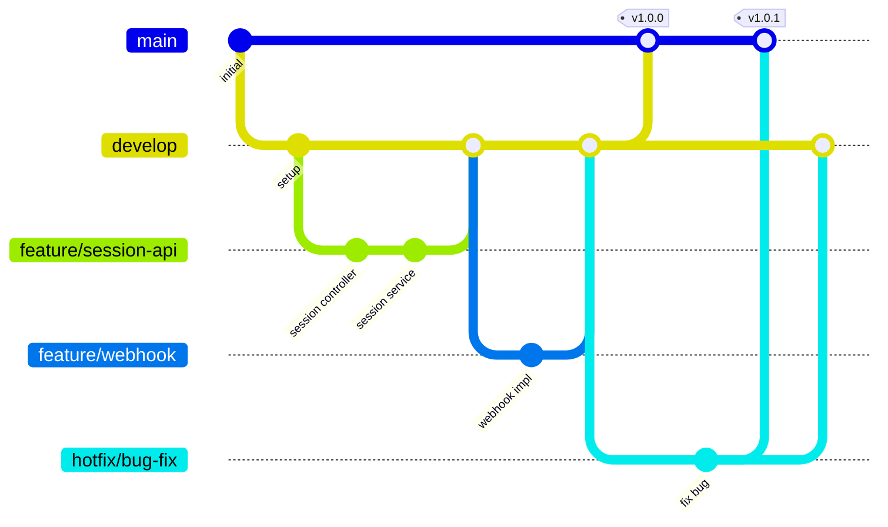

# 08 - Development Guidelines

## 8.1 Project Structure

```
openwa/
├── src/
│   ├── main.ts                    # Application entry
│   ├── app.module.ts              # Root module
│   ├── common/                    # Shared cache, security, storage, errors, utils
│   ├── config/                    # Runtime config, env validation, bootstrap security, Swagger
│   ├── core/                      # Hook and plugin framework
│   ├── database/                  # TypeORM data sources and migrations
│   ├── engine/                    # WhatsApp engine abstraction, adapters, identity mapping
│   ├── modules/                   # API feature modules
│   └── plugins/                   # Built-in engine and extension plugins
├── test/                          # E2E smoke tests and mocks
├── dashboard/                     # React/Vite dashboard
├── sdk/                           # JavaScript and Python SDK scaffolds
├── docs/                          # Documentation
├── scripts/                       # Utility scripts
├── .github/workflows/             # CI and release workflows
├── package.json
├── tsconfig.json
├── nest-cli.json
├── eslint.config.mjs
├── docker-compose.yml
├── docker-compose.dev.yml
├── Dockerfile
└── README.md
```

## 8.2 Coding Standards

### TypeScript Configuration

```json
// tsconfig.json
{
  "compilerOptions": {
    "module": "commonjs",
    "declaration": true,
    "removeComments": true,
    "emitDecoratorMetadata": true,
    "experimentalDecorators": true,
    "allowSyntheticDefaultImports": true,
    "target": "ES2022",
    "sourceMap": true,
    "outDir": "./dist",
    "baseUrl": "./",
    "incremental": true,
    "skipLibCheck": true,
    "strictNullChecks": true,
    "noImplicitAny": true,
    "strictBindCallApply": true,
    "forceConsistentCasingInFileNames": true,
    "noFallthroughCasesInSwitch": true,
    "paths": {
      "@/*": ["src/*"],
      "@common/*": ["src/common/*"],
      "@modules/*": ["src/modules/*"],
      "@config/*": ["src/config/*"]
    }
  }
}
```

### ESLint Configuration

The backend uses ESLint flat config in `eslint.config.mjs` with type-aware TypeScript rules,
Prettier integration, and an architecture guard for controllers. HTTP controllers must call
capability services; they must not import `IWhatsAppEngine` or call `getEngine()` directly.

```bash
npm run lint
npm run lint:fix
```

The dashboard has its own package scripts:

```bash
cd dashboard
npm run lint
```

### Naming Conventions

```typescript
// Files: kebab-case
session.controller.ts
send-message.dto.ts
api-key.guard.ts

// Classes: PascalCase
class SessionController {}
class SendMessageDto {}
class ApiKeyGuard {}

// Interfaces: PascalCase with 'I' prefix (optional)
interface ISessionConfig {}
interface SessionConfig {} // Also acceptable

// Functions/Methods: camelCase
function createSession() {}
async sendMessage() {}

// Variables: camelCase
const sessionId = 'abc';
let messageCount = 0;

// Constants: UPPER_SNAKE_CASE
const MAX_RETRY_COUNT = 3;
const DEFAULT_TIMEOUT = 30000;

// Enums: PascalCase with PascalCase values
enum SessionStatus {
  Created = 'created',
  Ready = 'ready',
  Disconnected = 'disconnected',
}
```

## 8.3 Module Structure

### Standard Module Template

```typescript
// modules/example/example.module.ts
import { Module } from '@nestjs/common';
import { TypeOrmModule } from '@nestjs/typeorm';
import { ExampleController } from './example.controller';
import { ExampleService } from './example.service';
import { ExampleRepository } from './example.repository';
import { Example } from './entities/example.entity';

@Module({
  imports: [TypeOrmModule.forFeature([Example], 'data')],
  controllers: [ExampleController],
  providers: [ExampleService, ExampleRepository],
  exports: [ExampleService],
})
export class ExampleModule {}
```

### Controller Template

```typescript
// modules/example/example.controller.ts
import { Controller, Get, Post, Body, Headers, Param, Delete, HttpCode, HttpStatus } from '@nestjs/common';
import { ApiTags, ApiOperation, ApiResponse } from '@nestjs/swagger';
import { ExampleService } from './example.service';
import { CreateExampleDto } from './dto/create-example.dto';
import { ExampleResponseDto } from './dto/example-response.dto';

@ApiTags('examples')
@Controller('examples')
export class ExampleController {
  constructor(private readonly exampleService: ExampleService) {}

  @Post()
  @HttpCode(HttpStatus.CREATED)
  @ApiOperation({ summary: 'Create example' })
  @ApiResponse({ status: 201, type: ExampleResponseDto })
  async create(
    @Body() dto: CreateExampleDto,
    @Headers('x-request-id') requestId?: string,
  ): Promise<ExampleResponseDto> {
    return this.exampleService.create(dto, { requestId });
  }

  @Get(':id')
  @ApiOperation({ summary: 'Get example by ID' })
  @ApiResponse({ status: 200, type: ExampleResponseDto })
  async findOne(@Param('id') id: string): Promise<ExampleResponseDto> {
    return this.exampleService.findOne(id);
  }

  @Delete(':id')
  @HttpCode(HttpStatus.NO_CONTENT)
  @ApiOperation({ summary: 'Delete example' })
  async remove(@Param('id') id: string): Promise<void> {
    return this.exampleService.remove(id);
  }
}
```

Controllers are protected by the global API key guard unless marked with `@Public()`. Keep
controllers thin: validate transport input through DTOs, delegate behavior to services, and never
call `SessionService.getEngine()` directly from a controller. Engine-specific details belong behind
capability services and engine adapters.

### Service Template

```typescript
// modules/example/example.service.ts
import { Injectable, NotFoundException, Logger } from '@nestjs/common';
import { ExampleRepository } from './example.repository';
import { CreateExampleDto } from './dto/create-example.dto';
import { Example } from './entities/example.entity';

@Injectable()
export class ExampleService {
  private readonly logger = new Logger(ExampleService.name);

  constructor(private readonly repository: ExampleRepository) {}

  async create(dto: CreateExampleDto, context?: { requestId?: string }): Promise<Example> {
    this.logger.log(`Creating example: ${dto.name}`, context);

    const example = this.repository.create(dto);
    return this.repository.save(example);
  }

  async findOne(id: string): Promise<Example> {
    const example = await this.repository.findOne({ where: { id } });

    if (!example) {
      throw new NotFoundException(`Example with ID ${id} not found`);
    }

    return example;
  }

  async remove(id: string): Promise<void> {
    const example = await this.findOne(id);
    await this.repository.remove(example);

    this.logger.log(`Deleted example: ${id}`);
  }
}
```

### DTO Template

```typescript
// modules/example/dto/create-example.dto.ts
import { IsString, IsOptional, MaxLength, IsUrl } from 'class-validator';
import { ApiProperty, ApiPropertyOptional } from '@nestjs/swagger';

export class CreateExampleDto {
  @ApiProperty({ description: 'Example name', example: 'My Example' })
  @IsString()
  @MaxLength(100)
  name: string;

  @ApiPropertyOptional({ description: 'Optional description' })
  @IsOptional()
  @IsString()
  @MaxLength(500)
  description?: string;

  @ApiPropertyOptional({ description: 'Callback URL' })
  @IsOptional()
  @IsUrl({ protocols: ['https'] })
  callbackUrl?: string;
}
```

## 8.4 Git Workflow

### Branch Strategy



### Branch Naming

```
main            # Production-ready code
develop         # Integration branch
feature/*       # New features
bugfix/*        # Bug fixes
hotfix/*        # Production hotfixes
release/*       # Release preparation

Examples:
feature/session-management
feature/webhook-retry
bugfix/qr-code-timeout
hotfix/security-patch
release/1.0.0
```

### Commit Message Convention

```
<type>(<scope>): <subject>

<body>

<footer>

Types:
- feat:     New feature
- fix:      Bug fix
- docs:     Documentation
- style:    Formatting (no code change)
- refactor: Code refactoring
- test:     Adding tests
- chore:    Maintenance

Examples:
feat(session): add multi-session support

- Implement session manager for multiple sessions
- Add session limit configuration
- Update documentation

Closes #123

fix(webhook): handle timeout errors gracefully

Previously, webhook timeouts would crash the worker.
Now they are caught and logged properly.

Fixes #456
```

### Pull Request Template

```markdown
## Description

Brief description of changes

## Type of Change

- [ ] Bug fix
- [ ] New feature
- [ ] Breaking change
- [ ] Documentation update

## Checklist

- [ ] Tests added/updated
- [ ] Documentation updated
- [ ] Lint passes
- [ ] Self-reviewed

## Screenshots (if applicable)

## Related Issues

Closes #
```

## 8.5 Testing Guidelines

### Test Structure

Unit tests live next to source files as `*.spec.ts`. E2E smoke tests live in `test/`.

```
src/
├── common/security/ssrf-guard.spec.ts
├── engine/adapters/baileys.adapter.spec.ts
├── modules/session/session.service.spec.ts
└── modules/webhook/webhook.service.spec.ts

test/
├── app.e2e-spec.ts
├── baileys-engine.e2e-spec.ts
├── serve-static.e2e-spec.ts
├── jest-e2e.json
└── setup-e2e.ts
```

### Unit Test Example

```typescript
// src/modules/session/reconnect-config.spec.ts
import { resolveReconnectConfig } from './session.service';

describe('resolveReconnectConfig', () => {
  it('keeps reconnect settings finite and bounded', () => {
    expect(resolveReconnectConfig({ maxReconnectAttempts: 'bad', reconnectBaseDelay: -1 })).toEqual({
      maxAttempts: 5,
      baseDelay: 1000,
    });
  });
});
```

### E2E Test Example

```typescript
// test/app.e2e-spec.ts
import { Test, TestingModule } from '@nestjs/testing';
import { INestApplication } from '@nestjs/common';
import * as request from 'supertest';
import { AppModule } from '../src/app.module';

describe('App (e2e)', () => {
  let app: INestApplication;

  beforeAll(async () => {
    const moduleFixture: TestingModule = await Test.createTestingModule({
      imports: [AppModule],
    }).compile();

    app = moduleFixture.createNestApplication();
    await app.init();
  });

  afterAll(async () => {
    await app.close();
  });

  describe('GET /api/health', () => {
    it('returns health status without an API key', () => {
      return request(app.getHttpServer())
        .get('/api/health')
        .expect(200)
        .expect(res => {
          expect(res.body.status).toBe('ok');
        });
    });
  });
});
```

### Test Coverage Requirements

Run the normal backend checks before opening a PR:

```bash
npm test -- --runInBand
npm run test:e2e -- --runInBand
npm run lint
```

Coverage thresholds are enforced by Jest in `package.json`. Security-sensitive code under
`src/common/security/` has stricter thresholds than the global baseline.

## 8.6 Documentation Standards

### Code Documentation

````typescript
/**
 * Session service handles all session-related operations.
 *
 * @example
 * ```typescript
 * const session = await sessionService.create({ name: 'my-bot' });
 * console.log(session.id);
 * ```
 */
@Injectable()
export class SessionService {
  /**
   * Creates a new WhatsApp session.
   *
   * @param dto - Session creation parameters
   * @returns The created session with QR code if applicable
   * @throws {ConflictException} If session name already exists
   * @throws {ServiceUnavailableException} If max sessions reached
   */
  async create(dto: CreateSessionDto): Promise<Session> {
    // Implementation
  }
}
````

### API Documentation (Swagger)

```typescript
@ApiTags('sessions')
@Controller('sessions')
export class SessionController {
  @Post()
  @ApiOperation({
    summary: 'Create a new session',
    description: 'Creates a new WhatsApp session and returns QR code for authentication',
  })
  @ApiBody({ type: CreateSessionDto })
  @ApiResponse({
    status: 201,
    description: 'Session created successfully',
    type: SessionResponseDto,
  })
  @ApiResponse({
    status: 409,
    description: 'Session name already exists',
  })
  async create(@Body() dto: CreateSessionDto): Promise<SessionResponseDto> {
    // Implementation
  }
}
```

## 8.7 Error Handling

### Custom Exception Classes

```typescript
// common/exceptions/business.exception.ts
export class BusinessException extends HttpException {
  constructor(
    public readonly code: string,
    message: string,
    statusCode: HttpStatus = HttpStatus.BAD_REQUEST,
    public readonly details?: Record<string, any>,
  ) {
    super({ code, message, details }, statusCode);
  }
}

// Usage
throw new BusinessException('SESSION_NOT_READY', 'Session is not ready to send messages', HttpStatus.BAD_REQUEST, {
  sessionId,
  currentStatus: session.status,
});
```

### Global Exception Filter

```typescript
// common/filters/http-exception.filter.ts
@Catch()
export class AllExceptionsFilter implements ExceptionFilter {
  private readonly logger = new Logger(AllExceptionsFilter.name);

  catch(exception: unknown, host: ArgumentsHost): void {
    const ctx = host.switchToHttp();
    const response = ctx.getResponse<Response>();
    const request = ctx.getRequest<Request>();

    const status = exception instanceof HttpException ? exception.getStatus() : HttpStatus.INTERNAL_SERVER_ERROR;

    const errorResponse = this.formatError(exception, request);

    this.logger.error(
      `${request.method} ${request.url} - ${status}`,
      exception instanceof Error ? exception.stack : undefined,
    );

    response.status(status).json(errorResponse);
  }

  private formatError(exception: unknown, request: Request) {
    const status = exception instanceof HttpException ? exception.getStatus() : HttpStatus.INTERNAL_SERVER_ERROR;
    // Return NestJS default error shape: { statusCode, message, error }
    return {
      statusCode: status,
      message: this.getErrorMessage(exception),
      error: this.getErrorCode(exception),
    };
  }
}
```

---

## 8.8 Environment Setup

### Prerequisites

```bash
# Required
- Node.js 22 LTS
- npm 10+
- Docker & Docker Compose
- Git

# Optional (for development)
- VS Code with extensions
- Postman or Insomnia
- pgAdmin or DBeaver
```

### Quick Start

```bash
# 1. Clone repository
git clone https://github.com/rmyndharis/OpenWA.git
cd OpenWA

# 2. Install dependencies (also installs dashboard dependencies)
npm install

# 3. Start API + dashboard in development mode
npm run dev
```

On first boot the API creates `data/.env.generated` with a minimal SQLite/local-storage
configuration. A project-level `.env` is optional; real process environment variables take precedence
over `.env`, which takes precedence over `data/.env.generated`.

For a production-image local smoke test:

```bash
docker compose -f docker-compose.dev.yml up -d --build
```

For production compose:

```bash
docker compose up -d
docker compose --profile postgres up -d
docker compose --profile full up -d
```

### VS Code Extensions

```json
// .vscode/extensions.json
{
  "recommendations": [
    "dbaeumer.vscode-eslint",
    "esbenp.prettier-vscode",
    "ms-azuretools.vscode-docker",
    "humao.rest-client",
    "bradlc.vscode-tailwindcss",
    "orta.vscode-jest"
  ]
}
```

### VS Code Settings

```json
// .vscode/settings.json
{
  "editor.formatOnSave": true,
  "editor.defaultFormatter": "esbenp.prettier-vscode",
  "editor.codeActionsOnSave": {
    "source.fixAll.eslint": true
  },
  "typescript.preferences.importModuleSpecifier": "relative",
  "files.exclude": {
    "**/node_modules": true,
    "**/dist": true
  }
}
```

### Environment Variables

OpenWA supports multiple infrastructure configurations. Choose based on your needs:

#### Minimal Profile (Development / Single Session)

```bash
# Application
NODE_ENV=development
PORT=2785
LOG_LEVEL=debug

# Database: SQLite (zero config)
DATABASE_TYPE=sqlite
DATABASE_NAME=./data/openwa.sqlite
DATABASE_SYNCHRONIZE=true

# Storage: Local filesystem
STORAGE_TYPE=local
STORAGE_LOCAL_PATH=./data/media

# Redis and queue disabled by default
REDIS_ENABLED=false
QUEUE_ENABLED=false

# Optional: seed a known admin key. If omitted, OpenWA generates a random key and writes data/.api-key.
API_MASTER_KEY=

# Session
SESSION_DATA_PATH=./data/sessions
# Optional: send a WhatsApp alert to this number whenever a session connects or reconnects
# MONITORING_NUMBER=628123456789

# Engine: whatsapp-web.js = Chromium-based; baileys = browser-free WebSocket
ENGINE_TYPE=whatsapp-web.js
PUPPETEER_HEADLESS=true

# Swagger is enabled by default. Set false to disable.
ENABLE_SWAGGER=true
```

#### Standard Profile (Production / Multi-Session)

```bash
# Application
NODE_ENV=production
PORT=2785
LOG_LEVEL=info

# Database: PostgreSQL
DATABASE_TYPE=postgres
DATABASE_HOST=postgres
DATABASE_PORT=5432
DATABASE_USERNAME=openwa
DATABASE_PASSWORD=<set-a-strong-password>
DATABASE_NAME=openwa
DATABASE_SYNCHRONIZE=false
DATABASE_POOL_SIZE=10

# Storage: Local filesystem
STORAGE_TYPE=local
STORAGE_LOCAL_PATH=/app/data/media

# Cache: Redis
REDIS_ENABLED=true
REDIS_HOST=redis
REDIS_PORT=6379
QUEUE_ENABLED=true

# Security
API_MASTER_KEY=<set-a-strong-initial-admin-key>
API_KEY_PEPPER=<optional-hash-pepper>
CORS_ORIGINS=https://dashboard.example.com

# Session
SESSION_DATA_PATH=/app/data/sessions
# Optional: send a WhatsApp alert to this number whenever a session connects or reconnects
# MONITORING_NUMBER=628123456789

# Engine
ENGINE_TYPE=whatsapp-web.js
PUPPETEER_HEADLESS=true
PUPPETEER_ARGS=--no-sandbox,--disable-setuid-sandbox,--disable-dev-shm-usage,--disable-gpu
ENABLE_SWAGGER=false
```

> [!TIP]
> For development, use the minimal profile with SQLite. PostgreSQL, Redis, and S3/MinIO are optional.

## 8.9 Debugging Guide

### NestJS Debugging

```json
// .vscode/launch.json
{
  "version": "0.2.0",
  "configurations": [
    {
      "name": "Debug NestJS",
      "type": "node",
      "request": "launch",
      "runtimeExecutable": "npm",
      "runtimeArgs": ["run", "start:debug"],
      "console": "integratedTerminal",
      "restart": true,
      "autoAttachChildProcesses": true
    },
    {
      "name": "Debug Tests",
      "type": "node",
      "request": "launch",
      "runtimeExecutable": "npm",
      "runtimeArgs": ["run", "test:debug"],
      "console": "integratedTerminal"
    }
  ]
}
```

### Logging Best Practices

```typescript
// Use Logger from NestJS
import { Logger, Inject, Scope } from '@nestjs/common';
import { REQUEST } from '@nestjs/core';
import { Request } from 'express';

@Injectable({ scope: Scope.REQUEST })
export class MyService {
  private readonly logger = new Logger(MyService.name);

  constructor(@Inject(REQUEST) private readonly request: Request) {}

  async doSomething(id: string): Promise<void> {
    // Log entry with context
    const requestId = this.request?.requestId;
    this.logger.log(`Processing item`, { id, requestId });

    try {
      await this.process(id);
      this.logger.log(`Item processed successfully`, { id, requestId });
    } catch (error) {
      // Log error with full stack
      this.logger.error(`Failed to process item`, error.stack, { id, requestId });
      throw error;
    }
  }
}
```

> [!NOTE]
> Propagate `X-Request-ID` from controller to service and include it in all logs for easier cross-component tracing.

### Request ID Interceptor (Optional)

Use an interceptor to ensure every request has a `requestId` and propagate it to the response header.

```typescript
// common/interceptors/request-id.interceptor.ts
import { CallHandler, ExecutionContext, Injectable, NestInterceptor } from '@nestjs/common';
import { Observable } from 'rxjs';

@Injectable()
export class RequestIdInterceptor implements NestInterceptor {
  intercept(context: ExecutionContext, next: CallHandler): Observable<any> {
    const request = context.switchToHttp().getRequest();
    const response = context.switchToHttp().getResponse();

    const requestId = request.headers['x-request-id'] || `req_${Date.now()}`;
    request.requestId = requestId;
    response.setHeader('X-Request-ID', requestId);

    return next.handle();
  }
}
```

```typescript
// main.ts
async function bootstrap() {
  const app = await NestFactory.create(AppModule);
  app.useGlobalInterceptors(new RequestIdInterceptor());
  await app.listen(3000);
}
```

> [!NOTE]
> If you use `REQUEST` injection in a service, make sure the provider is **request-scoped** (`@Injectable({ scope: Scope.REQUEST })`) so requestId does not get mixed across requests.

### Debug WhatsApp Engine

```typescript
// Enable verbose logging for whatsapp-web.js
const client = new Client({
  puppeteer: {
    headless: false, // See browser window
    devtools: true, // Open DevTools automatically
  },
});

// Log all events for debugging
const events = ['qr', 'ready', 'authenticated', 'disconnected', 'message'];
events.forEach(event => {
  client.on(event, (...args) => {
    console.log(`[WA Event: ${event}]`, JSON.stringify(args, null, 2));
  });
});
```

### Common Debugging Commands

```bash
# Run single test file
npm test -- session.service.spec.ts

# Run tests with verbose output
npm test -- --verbose

# Check for TypeScript errors
npm run build -- --noEmit

# Lint with auto-fix
npm run lint -- --fix

# Debug database queries (TypeORM)
# Add to .env: DEBUG=typeorm:query

# View Docker logs
docker compose logs -f app
```

## 8.10 Performance Best Practices

### Database Queries

```typescript
// ❌ Bad: N+1 query problem
const sessions = await sessionRepo.find();
for (const session of sessions) {
  session.webhooks = await webhookRepo.find({ where: { sessionId: session.id } });
}

// ✅ Good: Use relations
const sessions = await sessionRepo.find({
  relations: ['webhooks'],
});

// ✅ Good: Use QueryBuilder for complex queries
const sessions = await sessionRepo
  .createQueryBuilder('session')
  .leftJoinAndSelect('session.webhooks', 'webhook')
  .where('session.status = :status', { status: 'ready' })
  .orderBy('session.createdAt', 'DESC')
  .take(10)
  .getMany();
```

### Caching Strategy

```typescript
// CacheService exposes typed helpers; prefer those over ad hoc string keys in feature code.
@Injectable()
export class SessionStatsService {
  constructor(private readonly cache: CacheService) {}

  async getCachedStats(): Promise<SessionStats | null> {
    return this.cache.getSessionsStats();
  }

  async updateCachedStats(stats: SessionStats): Promise<void> {
    await this.cache.setSessionsStats(stats);
  }
}
```

### Async Operations

```typescript
// ❌ Bad: Sequential execution
const contact1 = await getContact('id1');
const contact2 = await getContact('id2');
const contact3 = await getContact('id3');

// ✅ Good: Parallel execution
const [contact1, contact2, contact3] = await Promise.all([getContact('id1'), getContact('id2'), getContact('id3')]);

// ✅ Good: Batch processing with concurrency limit
import pLimit from 'p-limit';

const limit = pLimit(5); // Max 5 concurrent
const results = await Promise.all(chatIds.map(id => limit(() => sendMessage(id, text))));
```

### Memory Management

```typescript
// Bound teardown so one stuck browser/socket cannot block shutdown.
@Injectable()
export class EngineTeardownService {
  private readonly logger = new Logger(EngineTeardownService.name);

  async destroyWithTimeout(sessionId: string, engine: IWhatsAppEngine): Promise<void> {
    const timeout = new Promise<never>((_, reject) => {
      setTimeout(() => reject(new Error('engine.destroy() timed out')), 10_000);
    });

    try {
      await Promise.race([engine.destroy(), timeout]);
    } catch (error) {
      this.logger.warn(`Engine teardown failed for ${sessionId}: ${String(error)}`);
    }
  }
}
```

## 8.11 Common Gotchas & Troubleshooting

### WhatsApp Engine Issues

```markdown
## QR Code Not Generated

**Symptom:** Session stuck in 'initializing' status

**Causes & Solutions:**

1. **Chrome/Puppeteer issue**
   - Ensure Chromium is installed: `which chromium`
   - Check Puppeteer args: `--no-sandbox --disable-setuid-sandbox`

2. **Previous session data corrupted**
   - Clear the stored auth/session data for the session under `data/sessions`
   - For Baileys, also check `BAILEYS_AUTH_DIR` (default `./data/baileys`)

3. **WhatsApp rate limit**
   - Wait 5-10 minutes before retrying

## Session Disconnects Randomly

**Causes & Solutions:**

1. **Memory pressure**
   - Monitor memory: `docker stats`
   - Increase container memory limit

2. **Network issues**
   - Check WebSocket connection stability
   - Implement auto-reconnect logic

3. **WhatsApp detected automation**
   - Add random delays between messages
   - Avoid sending too many messages quickly
```

### Database Issues

````markdown
## Connection Pool Exhausted

**Symptom:** "too many clients already" error

**Solution:**

```typescript
// config/typeorm.config.ts
{
  type: 'postgres',
  // Limit pool size
  extra: {
    max: 20, // Default is 10
    connectionTimeoutMillis: 5000,
    idleTimeoutMillis: 30000,
  },
}
```
````

## Migration Fails

**Symptom:** "relation already exists" error

**Solution:**

```bash
# Check migration status
npm run migration:show

# Revert last migration
npm run migration:revert

# Regenerate migration
npm run migration:generate --name=FixMigration
```

````

### TypeScript/NestJS Issues

```markdown
## Circular Dependency

**Symptom:** "Cannot read property 'X' of undefined"

**Solution:**
```typescript
// Use forwardRef for circular deps
@Module({
  imports: [
    forwardRef(() => SessionModule),
  ],
})
export class WebhookModule {}

// In service
constructor(
  @Inject(forwardRef(() => SessionService))
  private readonly sessionService: SessionService,
) {}
````

## DI Token Not Found

**Symptom:** "Nest can't resolve dependencies"

**Solution:**

- Ensure provider is exported from its module
- Check if module is imported where needed
- Use @Injectable() decorator on services

````

### Docker Issues

```markdown
## Container Keeps Restarting

**Check logs:**
```bash
docker compose logs openwa-api --tail 100
````

**Common causes:**

1. Missing environment variables
2. Database not ready (use depends_on + healthcheck)
3. Port already in use

## Chrome Crashes in Docker

**Solution:**

```dockerfile
# Add shared memory size
docker run --shm-size=2gb openwa
```

Or in docker-compose.yml:

```yaml
services:
  openwa-api:
    shm_size: '2gb'
```

````

## 8.12 Contributing Guide

### Getting Started

```markdown
1. Fork the repository
2. Create feature branch: `git checkout -b feature/amazing-feature`
3. Make changes following our coding standards
4. Write/update tests
5. Run linter: `npm run lint`
6. Run tests: `npm test`
7. Commit: `git commit -m 'feat(scope): add amazing feature'`
8. Push: `git push origin feature/amazing-feature`
9. Open Pull Request
````

### Code Review Checklist

```markdown
- [ ] Code follows project style guide
- [ ] Tests are included and passing
- [ ] Documentation is updated
- [ ] No console.log statements
- [ ] Error handling is proper
- [ ] No hardcoded values
- [ ] Security considerations addressed
- [ ] Performance impact considered
```

### Issue Reporting

```markdown
**Bug Report Template:**

- **Description:** Clear description of the bug
- **Steps to Reproduce:** Numbered steps
- **Expected Behavior:** What should happen
- **Actual Behavior:** What actually happens
- **Environment:** Node version, OS, Docker version
- **Logs:** Relevant error logs
```

---

<div align="center">

[← 07 - API Collection](./07-api-collection.md) · [Documentation Index](./README.md) · [Next: 09 - Testing Strategy →](./09-testing-strategy.md)

</div>
