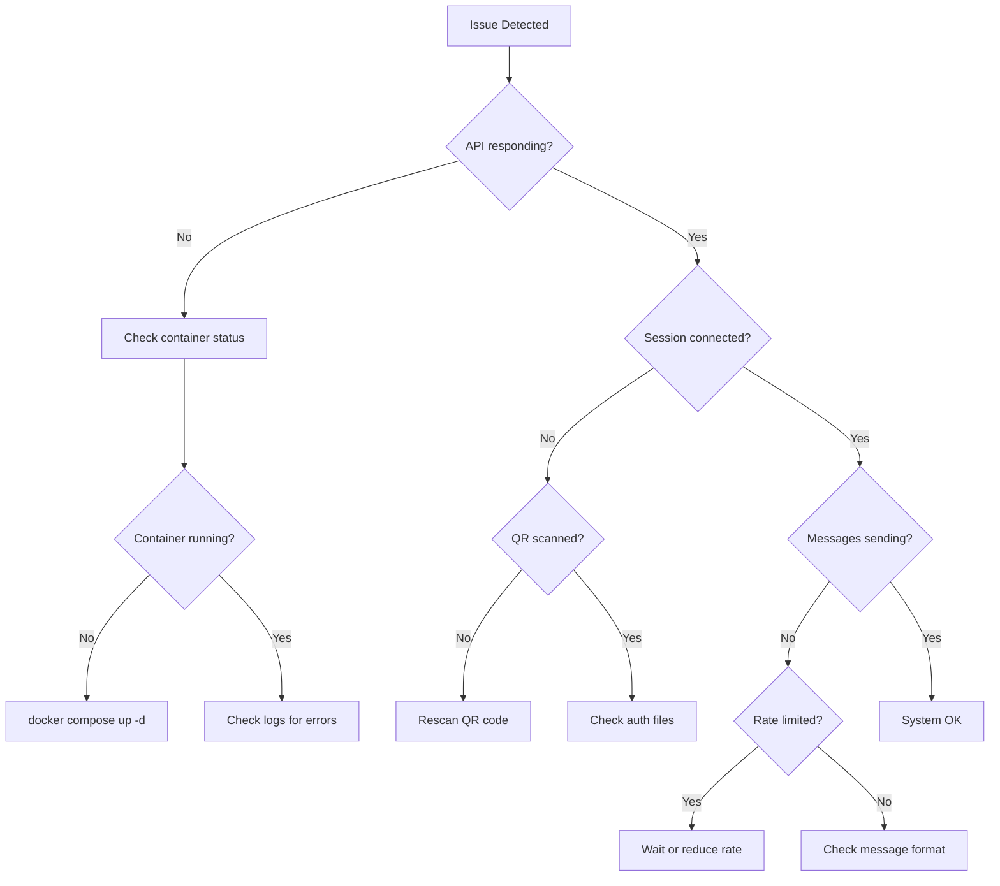
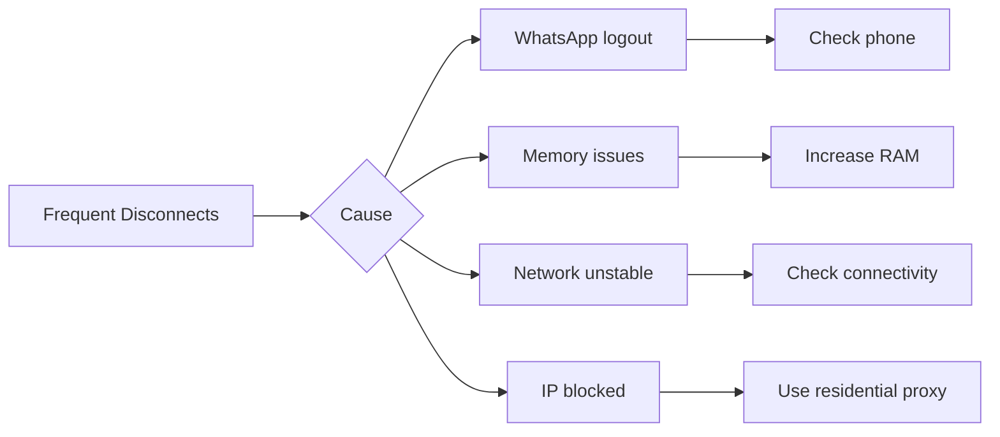
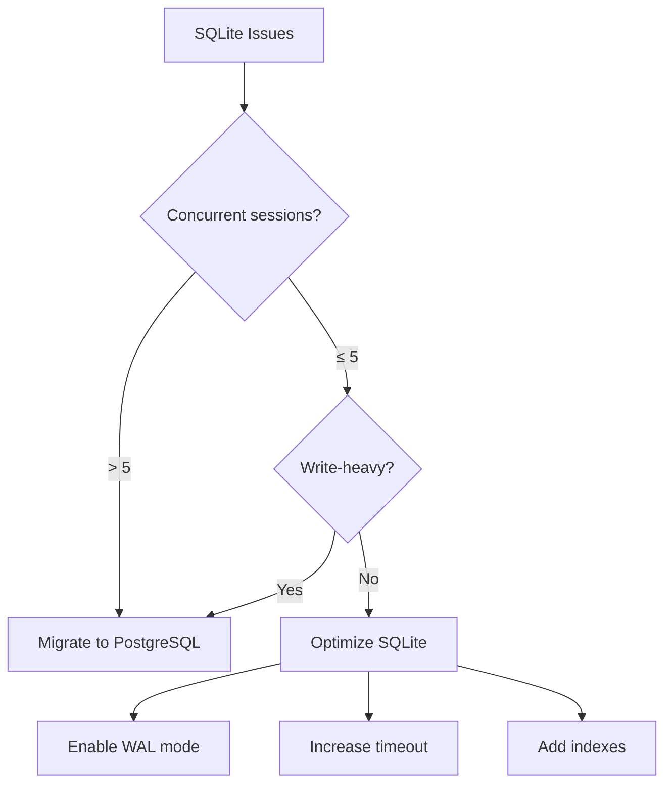

# 12 - Troubleshooting & FAQ

## 12.1 Quick Diagnostics

### Health Check Commands

```bash
# Basic health check
curl http://localhost:2785/health

# Detailed health check
curl -H "X-API-Key: $API_KEY" \
  http://localhost:2785/health/detailed

# Check specific session
curl -H "X-API-Key: $API_KEY" \
  http://localhost:2785/api/sessions/{sessionId}/health

# Check all services
docker compose ps
docker compose logs --tail=50

# System resources
docker stats openwa
```

### Diagnostic Flowchart



## 12.2 Podman Compatibility

### Issue: `FileNotFoundError` / Docker socket missing

**Symptoms:**

```text
docker.errors.DockerException: Error while fetching server API version:
  ('Connection aborted.', FileNotFoundError(2, 'No such file or directory'))
```

**Cause:** The system uses Podman (not Docker Engine). Podman's rootless socket is inactive by default.

**Fix:**

```bash
systemctl --user start podman.socket
systemctl --user enable podman.socket
export DOCKER_HOST=unix:///run/user/$(id -u)/podman/podman.sock
```

Add the `export` to `~/.bashrc` to make it permanent.

---

### Issue: `short-name did not resolve to an alias`

**Symptoms:**

```text
Error: creating build container: short-name "nginx:alpine" did not resolve to an alias
and no unqualified-search registries are defined
```

**Cause:** Podman rootless mode does not fall back to Docker Hub for unqualified image names.

**Fix:** All `FROM` directives in the `Dockerfile` must use fully-qualified names:

```dockerfile
FROM docker.io/node:22-slim
```

---

### Issue: Healthcheck always `unhealthy` on Node 22 + Podman

**Symptoms:** Container starts successfully but stays `unhealthy`; logs show:

```text
SyntaxError: Unexpected end of input
at evalTypeScript (node:internal/process/execution:256:22)
```

**Cause:** Node 22 routes `node -e` through its TypeScript evaluator which rejects arrow-function
syntax. Podman also splits quoted shell commands on whitespace, truncating the `-e` argument.

**Fix:** Use `curl` for the healthcheck instead of `node -e`:

```dockerfile
HEALTHCHECK --interval=30s --timeout=10s --start-period=30s --retries=3 \
    CMD curl -f http://localhost:2785/api/health || exit 1
```

```yaml
# docker-compose.dev.yml
healthcheck:
  test: ['CMD', 'curl', '-f', 'http://localhost:2785/api/health']
```

Ensure `curl` is installed in the production stage:

```dockerfile
RUN apt-get install -y ... curl ...
```

---

## 12.3 Connection Issues

### Issue: Container Won't Start

**Symptoms:**
- `docker compose up` fails
- Container exits immediately
- "Port already in use" error

**Solutions:**

```bash
# Check what's using the port
lsof -i :2785
# or
netstat -tlnp | grep 3000

# Kill process using port
kill -9 $(lsof -t -i:2785)

# Check Docker logs
docker compose logs openwa

# Common fixes
docker compose down --volumes  # Reset volumes
docker system prune -f         # Clean up Docker
docker compose pull            # Get latest image
docker compose up -d
```

### Issue: Session Won't Connect

**Symptoms:**
- QR code generated but session stays "INITIALIZING"
- "TIMEOUT" status after scanning QR
- Session stuck in "CONNECTING" state

**Diagnostic:**

```bash
# Check session status
curl -H "X-API-Key: $API_KEY" \
  http://localhost:2785/api/sessions/{sessionId}

# Check WhatsApp engine logs
docker compose logs openwa 2>&1 | grep -i "whatsapp\|puppeteer\|browser"

# Check auth folder
ls -la ./data/.wwebjs_auth/session-{sessionId}/
```

**Solutions:**

| Cause | Solution |
|-------|----------|
| Expired QR | Generate new QR (valid 60 seconds) |
| Auth folder corrupted | Delete and rescan |
| Browser crash | Restart container |
| Network issues | Check firewall/proxy |
| WhatsApp blocked | Use proxy |

```bash
# Clear auth and restart
rm -rf ./data/.wwebjs_auth/session-{sessionId}
docker compose restart openwa

# If using proxy
export PROXY_URL=http://proxy:8080
docker compose up -d
```

### Issue: Session stuck at `authenticating`, never reaches `ready`

> **Engine:** This issue applies to the `whatsapp-web.js` engine only. If you are using `ENGINE_TYPE=baileys`, skip this section.

**Symptoms:** After scanning the QR the phone links the device, but the session stays at
`authenticating` indefinitely and never becomes `ready`. `GET /sessions/:id/qr` returns 400 while
stuck. Often seen on ARM64 (e.g. Raspberry Pi) after upgrading to v0.2.x.

**Cause:** whatsapp-web.js auto-selects a WhatsApp Web client version, and an incompatible version
stalls the post-link sync. (If you also see `chrome_crashpad_handler: --database is required` *and the
session never starts at all*, that is a different problem — see "Session fails to launch …" below.)

**Fix:** pin a known-good WhatsApp Web version with `WWEBJS_WEB_VERSION`:

```bash
# Confirmed to reach "ready" (incl. ARM64 / Raspberry Pi 5):
WWEBJS_WEB_VERSION=2.3000.1023204257
```

Restart the container after setting it. Browse newer versions at
[wppconnect-team/wa-version](https://github.com/wppconnect-team/wa-version) (the `html/` folder).
Set `WWEBJS_WEB_VERSION=latest` (or leave it unset) to restore the default auto-version behavior.

### Issue: Session fails to launch with `chrome_crashpad_handler: --database is required`

> **Engine:** This issue applies to the `whatsapp-web.js` engine only (Chromium/Puppeteer-based). It does not affect `ENGINE_TYPE=baileys`.

**Symptoms:** The session never starts; the engine log shows `Failed to launch the browser process` with
`chrome_crashpad_handler: --database is required`, and the host kernel log shows a Chromium
`trap int3` / `Trace/breakpoint trap (core dumped)`. Seen on hardened, `read_only` containers.

**Cause:** Chromium resolves its home directory from the passwd entry (glibc `getpwuid()`) and **ignores
`$HOME`**. The non-root `openwa` user has no home dir, so Chromium tries to use `/home/openwa`, which does
not exist on the read-only rootfs — and aborts at launch. (Setting `HOME=` does **not** help, and
`--crash-dumps-dir` is a no-op for the crashpad database on Debian/Ubuntu system Chromium.)

**Fix:** Give Chromium writable, pre-created config/cache dirs via `XDG_CONFIG_HOME` / `XDG_CACHE_HOME`.
The bundled image and `docker-compose.yml` already do this (the entrypoint creates them on the tmpfs `/tmp`,
owned by `openwa`). If you run a custom container, ensure both are set to a writable, existing path:

```bash
XDG_CONFIG_HOME=/tmp/.config
XDG_CACHE_HOME=/tmp/.cache
# and create them owned by the runtime user before launch:
#   mkdir -p /tmp/.config /tmp/.cache && chown <user> /tmp/.config /tmp/.cache
```

On a `read_only` rootfs you **must** also mount a writable tmpfs/emptyDir at `/tmp` (compose:
`tmpfs: [/tmp]`; k8s: an `emptyDir` at `/tmp`) — otherwise the entrypoint cannot create these dirs and
will exit at startup with a clear `FATAL:` message rather than crash-looping later.

Do **not** work around this by dropping `--no-sandbox` security hardening or using `seccomp:unconfined`
(confirmed not to help, and it widens the attack surface).

### Issue: Frequent Disconnections

**Symptoms:**
- Session disconnects every few hours
- "DISCONNECTED" status in logs
- Need to rescan QR frequently

**Causes & Solutions:**



**Configuration fixes:**

```env
# Increase reconnection attempts
WA_RECONNECT_INTERVAL=5000
WA_MAX_RECONNECT_ATTEMPTS=10

# Enable session persistence
WA_PERSISTENT_SESSION=true

# Increase timeouts
WA_AUTH_TIMEOUT=120000
WA_QR_TIMEOUT=60000
```

## 12.3 Messaging Issues

### Issue: Messages Not Sending

**Symptoms:**
- API returns 200 but message not delivered
- "Message send failed" errors
- Messages stuck in queue

**Diagnostic:**

```bash
# Check message status
curl -H "X-API-Key: $API_KEY" \
  http://localhost:2785/api/sessions/{sessionId}/messages/{messageId}

# Check queue status
curl -H "X-API-Key: $API_KEY" \
  http://localhost:2785/api/queues/status

# Check rate limit status
curl -H "X-API-Key: $API_KEY" \
  http://localhost:2785/api/sessions/{sessionId}/rate-limit
```

**Common Causes:**

| Cause | Symptom | Solution |
|-------|---------|----------|
| Invalid phone number | 400 error | Format: `628123456789@c.us` |
| Rate limited | 429 error | Reduce sending rate |
| Session disconnected | 503 error | Reconnect session |
| Media too large | 413 error | Compress or reduce size |
| Number not on WhatsApp | Message fails silently | Verify number first |

**Phone Number Validation:**

```typescript
// Correct format
const validFormats = [
  '628123456789@c.us',      // Indonesian
  '14155552671@c.us',       // US
  '628123456789-1234@g.us', // Group ID
];

// API to check if number exists
// GET /api/sessions/{id}/contacts/{phone}/exists
curl -H "X-API-Key: $API_KEY" \
  "http://localhost:2785/api/sessions/default/contacts/628123456789/exists"
```

### Issue: Media Upload Fails

**Symptoms:**
- "File too large" error
- "Unsupported media type" error
- Upload timeout

**Solutions:**

```bash
# Check file size limit
echo $MAX_FILE_SIZE  # Default: 16MB

# Increase limit in docker-compose.yml
environment:
  - MAX_FILE_SIZE=64mb
  - UPLOAD_TIMEOUT=60000

# Supported formats
# Images: jpg, jpeg, png, gif, webp
# Videos: mp4, 3gp
# Audio: mp3, ogg, wav, opus
# Documents: pdf, doc, docx, xls, xlsx, ppt, pptx
```

**Media Compression:**

```bash
# Compress image before sending
curl -X POST http://localhost:2785/api/sessions/{id}/messages \
  -H "X-API-Key: $API_KEY" \
  -F "phone=628123456789@c.us" \
  -F "type=image" \
  -F "media=@image.jpg" \
  -F "compress=true"  # Enable compression
```

### Issue: Webhook Not Receiving Messages

**Symptoms:**
- Messages received but webhook not triggered
- Webhook URL returns errors
- Duplicate webhook calls

**Diagnostic:**

```bash
# Check webhook configuration
curl -H "X-API-Key: $API_KEY" \
  http://localhost:2785/api/sessions/{sessionId}/webhooks

# Check webhook logs
curl -H "X-API-Key: $API_KEY" \
  http://localhost:2785/api/sessions/{sessionId}/webhooks/{webhookId}/logs?limit=20

# Test webhook endpoint
curl -X POST http://your-webhook-url \
  -H "Content-Type: application/json" \
  -d '{"test": true}'
```

**Solutions:**

```yaml
# Webhook configuration
webhook:
  url: https://your-server.com/webhook
  events:
    - message.received
    - message.ack
    - session.status
  retry:
    max_attempts: 3
    delay: 5000
  timeout: 30000
  headers:
    Authorization: "Bearer your-token"
```

## 12.4 Performance Issues

### Issue: High Memory Usage

**Symptoms:**
- Container using > 1GB RAM per session
- OOM (Out of Memory) kills
- Slow response times

**Diagnostic:**

```bash
# Check memory usage
docker stats openwa --no-stream

# Check per-session memory
curl -H "X-API-Key: $API_KEY" \
  http://localhost:2785/api/metrics/memory

# Expected: ~300-500MB per session (whatsapp-web.js / Chromium engine)
# With ENGINE_TYPE=baileys the footprint is significantly lower (no Chromium)
```

**Solutions:**

```yaml
# docker-compose.yml - Set memory limits
services:
  openwa:
    deploy:
      resources:
        limits:
          memory: 2G
        reservations:
          memory: 512M
    environment:
      # Optimize Puppeteer (whatsapp-web.js engine only)
      - PUPPETEER_ARGS=--disable-dev-shm-usage,--disable-gpu,--no-sandbox
      # Limit cache
      - WA_CACHE_SIZE=1000
      # Disable media caching
      - CACHE_MEDIA=false
```

**Memory Optimization Tips:**

| Optimization | Impact | Trade-off |
|--------------|--------|-----------|
| Disable media cache | -30% RAM | Slower media re-send |
| Reduce message history | -20% RAM | Less searchable history |
| Headless Chrome flags | -15% RAM (wwebjs only) | None |
| Limit concurrent sessions | Linear | Fewer sessions |

### Issue: Slow API Response

**Symptoms:**
- API takes > 1 second to respond
- Timeout errors
- High latency for simple operations

**Diagnostic:**

```bash
# Measure API response time
time curl http://localhost:2785/health

# Check database query times
curl -H "X-API-Key: $API_KEY" \
  http://localhost:2785/api/metrics/database

# Check queue depth
curl -H "X-API-Key: $API_KEY" \
  http://localhost:2785/api/queues/status
```

**Solutions:**

```sql
-- SQLite: Add indexes
CREATE INDEX IF NOT EXISTS idx_messages_session_id ON messages(session_id);
CREATE INDEX IF NOT EXISTS idx_messages_created_at ON messages(created_at);
CREATE INDEX IF NOT EXISTS idx_contacts_session_id ON contacts(session_id);

-- PostgreSQL: Analyze tables
ANALYZE sessions;
ANALYZE messages;
ANALYZE contacts;
```

```yaml
# Enable connection pooling (PostgreSQL)
database:
  type: postgresql
  pool:
    min: 5
    max: 20
    idle_timeout: 30000

# Enable Redis caching
cache:
  adapter: redis
  ttl: 3600
```

## 12.5 Database Issues

### Issue: Database Locked (SQLite)

**Symptoms:**
- "SQLITE_BUSY" errors
- "database is locked" messages
- Write operations failing

**Solutions:**

```bash
# Check for long-running queries
sqlite3 ./data/openwa.db ".timeout 30000"

# Increase timeout in configuration
DATABASE_SQLITE_BUSY_TIMEOUT=30000

# Check WAL mode
sqlite3 ./data/openwa.db "PRAGMA journal_mode;"
# Should return: wal

# Enable WAL mode
sqlite3 ./data/openwa.db "PRAGMA journal_mode=WAL;"
```

**When to Migrate to PostgreSQL:**



### Issue: Database Migration Failed

**Symptoms:**
- "Migration failed" errors
- Schema mismatch
- Missing tables

**Solutions:**

```bash
# Check migration status
npm run migration:status

# Show pending migrations
npm run migration:show

# Force run specific migration
npm run migration:run -- --name CreateSessionsTable

# Rollback last migration
npm run migration:revert

# Sync schema (development only!)
npm run schema:sync
```

## 12.6 Docker Issues

### Issue: Volume Permissions

**Symptoms:**
- "Permission denied" errors
- Can't write to data directory
- Auth files not persisting

**Solutions:**

```bash
# Check current permissions
ls -la ./data/

# Fix ownership (use your user ID)
sudo chown -R $(id -u):$(id -g) ./data/

# Or use Docker's user mapping
# docker-compose.yml
services:
  openwa:
    user: "1000:1000"  # Your UID:GID
```

### Issue: Container Networking

**Symptoms:**
- Can't connect to database container
- Webhook calls fail from container
- "Connection refused" errors

**Solutions:**

```yaml
# docker-compose.yml - Ensure proper networking
services:
  openwa:
    networks:
      - openwa-network
    extra_hosts:
      - "host.docker.internal:host-gateway"  # Access host from container

  postgres:
    networks:
      - openwa-network

networks:
  openwa-network:
    driver: bridge
```

```bash
# Test connectivity from container
docker exec openwa ping postgres
docker exec openwa curl http://host.docker.internal:8080
```

## 12.7 Frequently Asked Questions

### General Questions

**Q: Is OpenWA safe to use?**
> A: OpenWA uses unofficial WhatsApp Web API. While we implement best practices to avoid detection, there's inherent risk of account restrictions. We recommend:
> - Use dedicated phone number (not personal)
> - Don't send spam or bulk unsolicited messages
> - Follow WhatsApp's Terms of Service
> - Implement rate limiting

**Q: How many sessions can I run?**
> A: Depends on your server resources and the engine in use. With the default `whatsapp-web.js` engine (Chromium-based), each session uses ~300-500MB RAM:
> - 2GB RAM: 3-5 sessions
> - 4GB RAM: 8-10 sessions
> - 8GB RAM: 15-20 sessions
>
> With `ENGINE_TYPE=baileys` (browser-free), RAM per session is significantly lower — you can run more sessions on the same hardware. Exact figures depend on message volume and group membership.

**Q: Can I use WhatsApp Business account?**
> A: Yes, OpenWA works with both personal and WhatsApp Business accounts. Note that WhatsApp Business API (official Meta API) is different and not supported.

**Q: How to avoid getting banned?**
> Best practices:
> - Don't send > 200 messages/day for new numbers
> - Gradually increase volume
> - Avoid identical messages to multiple recipients
> - Use random delays between messages
> - Don't send to numbers that haven't messaged you first

### Technical Questions

**Q: How to send messages to groups?**
```bash
# Get group list
curl -H "X-API-Key: $API_KEY" \
  http://localhost:2785/api/sessions/{id}/groups

# Send to group
curl -X POST http://localhost:2785/api/sessions/{id}/messages \
  -H "X-API-Key: $API_KEY" \
  -H "Content-Type: application/json" \
  -d '{
    "phone": "120363123456789@g.us",
    "type": "text",
    "body": "Hello group!"
  }'
```

**Q: How to handle message replies?**
```bash
# Reply to specific message
curl -X POST http://localhost:2785/api/sessions/{id}/messages \
  -H "X-API-Key: $API_KEY" \
  -H "Content-Type: application/json" \
  -d '{
    "phone": "628123456789@c.us",
    "type": "text",
    "body": "This is a reply",
    "quotedMessageId": "ABC123_DEF456"
  }'
```

**Q: How to use with n8n?**
> See [n8n Integration Guide](./examples/n8n-integration.md). Quick setup:
> 1. Add HTTP Request node
> 2. Set URL: `http://openwa:2785/api/sessions/{id}/messages`
> 3. Add header: `X-API-Key: your-key`
> 4. Configure webhook trigger for incoming messages

**Q: How to run behind reverse proxy (nginx)?**
```nginx
# nginx.conf
server {
    listen 443 ssl;
    server_name api.example.com;

    location / {
        proxy_pass http://localhost:2785;
        proxy_http_version 1.1;
        proxy_set_header Upgrade $http_upgrade;
        proxy_set_header Connection 'upgrade';
        proxy_set_header Host $host;
        proxy_set_header X-Real-IP $remote_addr;
        proxy_set_header X-Forwarded-For $proxy_add_x_forwarded_for;
        proxy_set_header X-Forwarded-Proto $scheme;
        proxy_cache_bypass $http_upgrade;

        # Timeouts for long-polling
        proxy_read_timeout 300;
        proxy_connect_timeout 300;
        proxy_send_timeout 300;
    }
}
```

**Q: How to backup sessions automatically?**
```bash
#!/bin/bash
# backup-cron.sh - Add to crontab: 0 */6 * * * /path/to/backup-cron.sh

BACKUP_DIR="/backups/openwa"
DATE=$(date +%Y%m%d-%H%M%S)

# Create backup directory
mkdir -p "$BACKUP_DIR/$DATE"

# Backup database
if [ "$DATABASE_ADAPTER" = "postgresql" ]; then
    pg_dump $DATABASE_URL > "$BACKUP_DIR/$DATE/database.sql"
else
    cp ./data/openwa.db "$BACKUP_DIR/$DATE/"
fi

# Backup auth sessions
# whatsapp-web.js engine:
cp -r ./data/.wwebjs_auth "$BACKUP_DIR/$DATE/"
# Baileys engine (ENGINE_TYPE=baileys): back up BAILEYS_AUTH_DIR (default: ./data/baileys)
# cp -r ./data/baileys "$BACKUP_DIR/$DATE/"

# Keep only last 7 days
find "$BACKUP_DIR" -type d -mtime +7 -exec rm -rf {} \;

echo "Backup completed: $BACKUP_DIR/$DATE"
```

### Webhook Questions

**Q: What events can I subscribe to?**
```yaml
available_events:
  # Messages
  - message.received     # New incoming message
  - message.sent         # Message sent
  - message.ack          # Message status update (sent, delivered, read)
  - message.revoked      # Message deleted
  - message.reaction     # Reaction added, changed, or removed

  # Session
  - session.status       # Session status change
  - session.qr           # New QR code generated
  - session.authenticated  # Session authenticated
  - session.disconnected   # Session disconnected

  # Groups
  - group.join           # Someone joined group
  - group.leave          # Someone left group
  - group.update         # Group settings changed

  # Contacts
  - contact.update       # Contact info changed
  - presence.update      # Contact online/offline status
```

**Q: Webhook payload format?**
```json
{
  "event": "message.received",
  "timestamp": "2026-02-02T10:30:00Z",
  "sessionId": "sess_abc123",
  "data": {
    "id": "ABC123_DEF456",
    "from": "628123456789@c.us",
    "to": "628987654321@c.us",
    "body": "Hello!",
    "type": "text",
    "timestamp": 1706868600,
    "isGroup": false,
    "author": null,
    "hasMedia": false,
    "media": null
  }
}
```

## 12.8 Error Code Reference

### HTTP Error Codes

| Code | Meaning | Common Cause | Solution |
|------|---------|--------------|----------|
| 400 | Bad Request | Invalid parameters | Check request body/params |
| 401 | Unauthorized | Missing/invalid API key | Add X-API-Key header |
| 403 | Forbidden | Insufficient permissions | Check API key permissions |
| 404 | Not Found | Invalid session/endpoint | Verify session exists |
| 409 | Conflict | Session already exists | Use different session ID |
| 413 | Payload Too Large | File too large | Reduce file size |
| 429 | Too Many Requests | Rate limited | Reduce request rate |
| 500 | Internal Error | Server error | Check logs |
| 503 | Service Unavailable | Session disconnected | Reconnect session |

### WhatsApp Error Codes

| Code | Meaning | Solution |
|------|---------|----------|
| `WA_SESSION_NOT_FOUND` | Session doesn't exist | Create session first |
| `WA_SESSION_NOT_READY` | Session not connected | Wait for connection or rescan QR |
| `WA_INVALID_PHONE` | Invalid phone format | Use format: 628xxx@c.us |
| `WA_NUMBER_NOT_EXISTS` | Number not on WhatsApp | Verify number |
| `WA_RATE_LIMITED` | Too many messages | Wait and reduce rate |
| `WA_MEDIA_ERROR` | Media processing failed | Check file format/size |
| `WA_GROUP_NOT_FOUND` | Group doesn't exist | Verify group ID |
| `WA_NOT_ADMIN` | Not group admin | Need admin rights |

## 12.9 Getting Help

### Before Asking for Help

1. **Check this FAQ** - Most common issues are covered
2. **Check logs** - `docker compose logs openwa --tail=100`
3. **Try basic troubleshooting** - Restart, clear cache, etc.
4. **Search GitHub issues** - Your issue might be already reported

### Reporting Issues

When creating GitHub issue, include:

```markdown
## Environment
- OpenWA version: x.x.x
- Docker version: x.x.x
- OS: Ubuntu 22.04 / macOS / Windows
- Database: SQLite / PostgreSQL
- Sessions count: X

## Issue Description
[Clear description of the problem]

## Steps to Reproduce
1. Step one
2. Step two
3. ...

## Expected Behavior
[What should happen]

## Actual Behavior
[What actually happens]

## Logs
```
[Paste relevant logs here]
```

## Configuration
```yaml
# Sanitized docker-compose.yml or .env
```
```

### Community Resources

- **GitHub Issues**: [github.com/rmyndharis/OpenWA/issues](https://github.com/rmyndharis/OpenWA/issues)
- **Discussions**: [github.com/rmyndharis/OpenWA/discussions](https://github.com/rmyndharis/OpenWA/discussions)
- **Discord**: [discord.gg/openwa](https://discord.gg/openwa) (if available)
- **Stack Overflow**: Tag with `openwa`
---

<div align="center">

[← 11 - Operational Runbooks](./11-operational-runbooks.md) · [Documentation Index](./README.md) · [Next: 13 - Horizontal Scaling Guide →](./13-horizontal-scaling.md)

</div>
