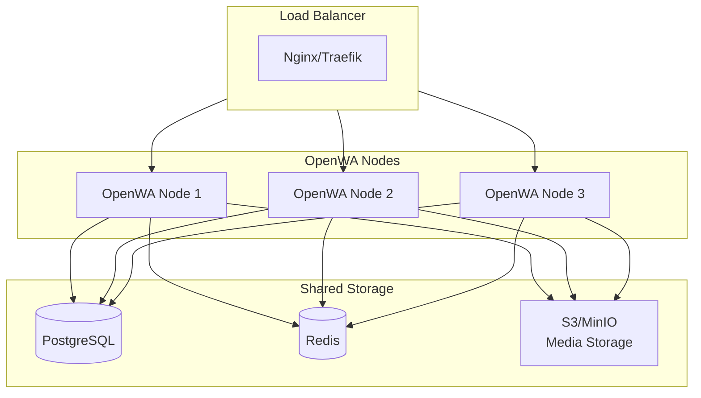

# 13 - Horizontal Scaling Guide

> ## ⚠️ DESIGN REFERENCE ONLY — NOT IMPLEMENTED
>
> **OpenWA is currently a single-process, single-instance application.** Live WhatsApp
> engine state (browser + WebSocket + reconnect/error state) lives in an in-memory `Map`
> in `SessionService`; there is **no** DB-backed session registry, **no** node-claim/lease,
> and **no** Socket.IO Redis adapter (findings H1/H11).
>
> **Supported topology:** exactly **one** API instance per session-data volume. Running
> multiple replicas against a shared session volume — as the multi-node examples below
> describe — will cause **two browsers to write the same WhatsApp LocalAuth directory and
> corrupt the session** (forced logout / ban), especially with `AUTO_START_SESSIONS=true`.
>
> Everything in this guide (session-claim, node affinity, `replicas: 3`) is a **future
> design sketch**, retained for planning. Until it is implemented, deploy with
> **`replicas: 1`** for the OpenWA API service.

This guide explains a *proposed* design for deploying OpenWA in a horizontally scaled environment for high availability and increased capacity.

## 13.1 Architecture Overview



### Key Principles

| Principle            | Description                                                   |
| -------------------- | ------------------------------------------------------------- |
| **Session Affinity** | WhatsApp sessions are stateful and must stay on the same node |
| **Shared Database**  | PostgreSQL stores all persistent data across nodes            |
| **Redis for State**  | Shared cache and queue coordination                           |
| **Sticky Sessions**  | Load balancer routes session requests to the correct node     |

## 13.2 Session Affinity Strategy

Since WhatsApp sessions maintain active connections (a browser instance for `whatsapp-web.js`, or a WebSocket for `baileys` — set via `ENGINE_TYPE`), they cannot be freely moved between nodes.

### Strategy 1: Session-to-Node Mapping (Recommended)

Store session-node mapping in the database:

```sql
-- Sessions table includes node assignment
ALTER TABLE sessions ADD COLUMN node_id VARCHAR(50);
ALTER TABLE sessions ADD COLUMN node_url VARCHAR(255);
```

The load balancer reads the mapping and routes accordingly.

### Strategy 2: Consistent Hashing

Route sessions based on session ID hash:

```typescript
function getNodeForSession(sessionId: string, nodes: string[]): string {
  const hash = crypto.createHash('md5').update(sessionId).digest('hex');
  const index = parseInt(hash.substring(0, 8), 16) % nodes.length;
  return nodes[index];
}
```

### Strategy 3: Session Claim

Each node "claims" sessions on startup and releases them on shutdown. **(Not implemented — no claim/lease logic exists in code; this is the design target.)**

## 13.3 Docker Swarm Deployment

### docker-compose.swarm.yml

```yaml
version: '3.8'

services:
  openwa:
    image: ghcr.io/rmyndharis/openwa:0.4.6
    deploy:
      replicas: 1 # MUST stay 1 until session-claim is implemented — multiple replicas on one session volume corrupt WhatsApp auth (H1/H11)
      update_config:
        parallelism: 1
        delay: 30s
      restart_policy:
        condition: on-failure
        max_attempts: 3
      resources:
        limits:
          memory: 2G
        reservations:
          memory: 512M
    environment:
      - NODE_ENV=production
      - DATABASE_TYPE=postgres
      - DATABASE_HOST=postgres
      - DATABASE_NAME=openwa
      - DATABASE_USER=openwa
      - DATABASE_PASSWORD=${DB_PASSWORD}
      - REDIS_HOST=redis
      - ENABLE_QUEUE=true
      - NODE_ID={{.Node.Hostname}}-{{.Task.Slot}}
    volumes:
      - sessions:/app/data/sessions
    networks:
      - openwa-net
    depends_on:
      - postgres
      - redis

  postgres:
    image: postgres:16-alpine
    deploy:
      replicas: 1
      placement:
        constraints:
          - node.role == manager
    environment:
      - POSTGRES_DB=openwa
      - POSTGRES_USER=openwa
      - POSTGRES_PASSWORD=${DB_PASSWORD}
    volumes:
      - postgres-data:/var/lib/postgresql/data
    networks:
      - openwa-net

  redis:
    image: redis:7-alpine
    deploy:
      replicas: 1
    command: redis-server --appendonly yes
    volumes:
      - redis-data:/data
    networks:
      - openwa-net

  # NOTE (v0.4.0): OpenWA no longer ships a bundled Traefik container.
  # For TLS / public exposure, bring your own reverse proxy (Traefik, nginx,
  # Caddy, a cloud load balancer, etc.) and point it at openwa:2785.
  # See section 13.5 for Traefik / nginx config examples.

volumes:
  postgres-data:
  redis-data:
  sessions:

networks:
  openwa-net:
    driver: overlay
```

### Deploy to Swarm

```bash
# Initialize swarm (if not already)
docker swarm init

# Deploy stack
docker stack deploy -c docker-compose.swarm.yml openwa

# Scale up/down
docker service scale openwa_openwa=5

# Check status
docker service ls
docker service ps openwa_openwa
```

## 13.4 Kubernetes Deployment

### k8s/namespace.yaml

```yaml
apiVersion: v1
kind: Namespace
metadata:
  name: openwa
```

### k8s/configmap.yaml

```yaml
apiVersion: v1
kind: ConfigMap
metadata:
  name: openwa-config
  namespace: openwa
data:
  NODE_ENV: 'production'
  DATABASE_TYPE: 'postgres'
  DATABASE_HOST: 'postgres-service'
  DATABASE_PORT: '5432'
  DATABASE_NAME: 'openwa'
  REDIS_HOST: 'redis-service'
  REDIS_PORT: '6379'
  ENABLE_QUEUE: 'true'
  PORT: '2785'
```

### k8s/secret.yaml

```yaml
apiVersion: v1
kind: Secret
metadata:
  name: openwa-secrets
  namespace: openwa
type: Opaque
stringData:
  DATABASE_USER: openwa
  DATABASE_PASSWORD: your-secure-password
  ADMIN_API_KEY: your-admin-api-key
  WEBHOOK_SECRET: your-webhook-secret
```

### k8s/deployment.yaml

```yaml
apiVersion: apps/v1
kind: StatefulSet
metadata:
  name: openwa
  namespace: openwa
spec:
  serviceName: openwa
  replicas: 1 # MUST stay 1 until session-claim is implemented (H1/H11) — see the warning at the top of this guide
  selector:
    matchLabels:
      app: openwa
  template:
    metadata:
      labels:
        app: openwa
    spec:
      containers:
        - name: openwa
          image: ghcr.io/rmyndharis/openwa:0.4.6
          ports:
            - containerPort: 2785
              name: http
          envFrom:
            - configMapRef:
                name: openwa-config
            - secretRef:
                name: openwa-secrets
          env:
            - name: NODE_ID
              valueFrom:
                fieldRef:
                  fieldPath: metadata.name
          resources:
            requests:
              memory: '512Mi'
              cpu: '250m'
            limits:
              memory: '2Gi'
              cpu: '1000m'
          volumeMounts:
            - name: session-data
              mountPath: /app/data/sessions
          livenessProbe:
            httpGet:
              path: /api/health
              port: 2785
            initialDelaySeconds: 30
            periodSeconds: 10
          readinessProbe:
            httpGet:
              path: /api/health/ready
              port: 2785
            initialDelaySeconds: 10
            periodSeconds: 5
  volumeClaimTemplates:
    - metadata:
        name: session-data
      spec:
        accessModes: ['ReadWriteOnce']
        resources:
          requests:
            storage: 10Gi
```

### k8s/service.yaml

```yaml
apiVersion: v1
kind: Service
metadata:
  name: openwa-service
  namespace: openwa
spec:
  type: ClusterIP
  selector:
    app: openwa
  ports:
    - port: 80
      targetPort: 2785
      name: http
---
apiVersion: v1
kind: Service
metadata:
  name: openwa-headless
  namespace: openwa
spec:
  clusterIP: None
  selector:
    app: openwa
  ports:
    - port: 2785
      name: http
```

### k8s/ingress.yaml

```yaml
apiVersion: networking.k8s.io/v1
kind: Ingress
metadata:
  name: openwa-ingress
  namespace: openwa
  annotations:
    nginx.ingress.kubernetes.io/affinity: 'cookie'
    nginx.ingress.kubernetes.io/session-cookie-name: 'openwa-session'
    nginx.ingress.kubernetes.io/session-cookie-max-age: '172800'
spec:
  ingressClassName: nginx
  rules:
    - host: openwa.example.com
      http:
        paths:
          - path: /
            pathType: Prefix
            backend:
              service:
                name: openwa-service
                port:
                  number: 80
  tls:
    - hosts:
        - openwa.example.com
      secretName: openwa-tls
```

### Deploy to Kubernetes

```bash
# Apply all manifests
kubectl apply -f k8s/

# Check pods
kubectl get pods -n openwa

# Check logs
kubectl logs -f deployment/openwa -n openwa

# Scale
kubectl scale statefulset openwa --replicas=5 -n openwa
```

## 13.5 Load Balancer Configuration

### Traefik Dynamic Config

```yaml
# traefik/dynamic-scaling.yml
http:
  routers:
    openwa:
      rule: 'Host(`openwa.example.com`)'
      service: openwa
      middlewares:
        - sticky-session

  middlewares:
    sticky-session:
      headers:
        customResponseHeaders:
          X-OpenWA-Node: '{{.Node}}'

  services:
    openwa:
      loadBalancer:
        sticky:
          cookie:
            name: openwa_node
            secure: true
            httpOnly: true
        servers:
          - url: 'http://openwa-1:2785'
          - url: 'http://openwa-2:2785'
          - url: 'http://openwa-3:2785'
        healthCheck:
          path: /api/health
          interval: 10s
          timeout: 3s
```

### Nginx Upstream Config

```nginx
upstream openwa {
    ip_hash;  # Sticky sessions based on client IP

    server openwa-1:2785 weight=1 max_fails=3 fail_timeout=30s;
    server openwa-2:2785 weight=1 max_fails=3 fail_timeout=30s;
    server openwa-3:2785 weight=1 max_fails=3 fail_timeout=30s;
}

server {
    listen 80;
    server_name openwa.example.com;

    location / {
        proxy_pass http://openwa;
        proxy_http_version 1.1;
        proxy_set_header Upgrade $http_upgrade;
        proxy_set_header Connection "upgrade";
        proxy_set_header Host $host;
        proxy_set_header X-Real-IP $remote_addr;
        proxy_set_header X-Forwarded-For $proxy_add_x_forwarded_for;

        # Session affinity cookie
        proxy_cookie_path / "/; SameSite=Strict; HttpOnly";
    }

    location /api/health {
        proxy_pass http://openwa;
        proxy_connect_timeout 5s;
        proxy_read_timeout 5s;
    }
}
```

## 13.6 Capacity Planning

### Resource Requirements per Node

| Sessions | Memory | CPU      | Disk  |
| -------- | ------ | -------- | ----- |
| 1-5      | 1 GB   | 0.5 vCPU | 5 GB  |
| 5-10     | 2 GB   | 1 vCPU   | 10 GB |
| 10-25    | 4 GB   | 2 vCPU   | 25 GB |
| 25-50    | 8 GB   | 4 vCPU   | 50 GB |

### Scaling Guidelines

| Metric                        | Threshold  | Action     |
| ----------------------------- | ---------- | ---------- |
| CPU > 80%                     | 5 minutes  | Scale up   |
| Memory > 85%                  | 5 minutes  | Scale up   |
| CPU < 30%                     | 15 minutes | Scale down |
| Active sessions per node > 20 | -          | Scale up   |

### Benchmarks

Tested on 2 vCPU / 4GB RAM nodes:

| Nodes | Sessions | Messages/sec | p95 Latency |
| ----- | -------- | ------------ | ----------- |
| 1     | 10       | 50           | 150ms       |
| 3     | 30       | 150          | 180ms       |
| 5     | 50       | 250          | 200ms       |

## 13.7 Monitoring

### Prometheus Metrics (Future)

```yaml
# prometheus/openwa-rules.yaml
groups:
  - name: openwa
    rules:
      - alert: HighMemoryUsage
        expr: container_memory_usage_bytes{container="openwa"} > 1.8e9
        for: 5m
        labels:
          severity: warning
        annotations:
          summary: 'OpenWA node high memory usage'

      - alert: NodeDown
        expr: up{job="openwa"} == 0
        for: 1m
        labels:
          severity: critical
        annotations:
          summary: 'OpenWA node is down'
```

### Health Check Endpoints

| Endpoint               | Purpose                         |
| ---------------------- | ------------------------------- |
| `/api/health`          | Liveness probe                  |
| `/api/health/ready`    | Readiness probe                 |
| `/api/health/detailed` | Full status with DB/Redis check |
---

<div align="center">

[← 12 - Troubleshooting & FAQ](./12-troubleshooting-faq.md) · [Documentation Index](./README.md) · [Next: 14 - Migration Guide →](./14-migration-guide.md)

</div>
